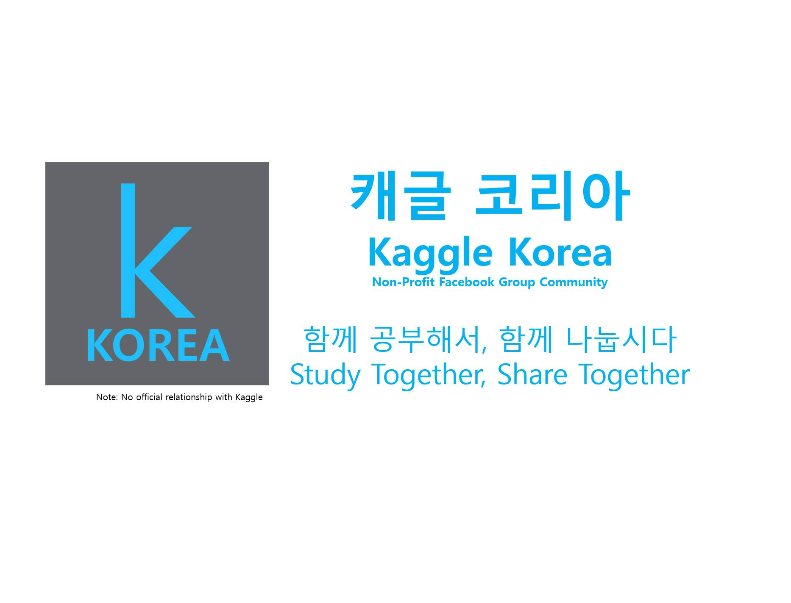

# Kaggle Korea Study Group

## `캐글 코리아` 산본지역 스터디 그룹

>  **[캐글 코리아 페이스북](https://www.facebook.com/groups/KaggleKoreaOpenGroup/)** 
>
> Note: No official relationship with kaggle

캐글 코리아의 지역 스터디 그룹 중 **산본** 지역에서 활동하는 캐글 스터디 그룹입니다.

 

## 스터디 기록

### 첫 번째 스터디 (2019. 10. 1)

운영진, 스터디원 소개 및 스터디 방향 의논

- **운영진**: [조윤기](https://github.com/joyoon729), 고재영
- **스터디원**: [김동규](https://github.com/DrumDong), [박지훈](https://github.com/jeehunpark), [이은용](https://github.com/namepen), [이정환](https://github.com/wjdghks9885)
- **스터디 방향**: kaggle-classification-competition 정복하기

 

### [두 번째 스터디](week2) (2019. 10. 8)

**참여인원**: 김동규, 박지훈, 이은용, 이정환, 조윤기

**내용**: [캐글 타이타닉](https://www.kaggle.com/c/titanic) 공부하기

|  이름  |                 자료                  |
| :----: | :-----------------------------------: |
| 김동규 | [titanic](week2/김동규_titanic1.ipynb)  |
| 박지훈 | [titanic (keras)](week2/박지훈_artificial-neural-network-using-keras.ipynb) |
| 이은용 |                                       |
| 이정환 | [titanic (XGBoost)](week2/이정환_titanic-using-XGBoost.ipynb) |
| 조윤기 | [titanic](week2/조윤기_titanic.ipynb) |

 

### [세 번째 스터디](week3) (2019. 10. 15)

**참여인원**: 김동규, 박지훈, 이은용, 이정환, 조윤기

**내용**: [캐글 Intermediate Machine Learning](https://www.kaggle.com/learn/intermediate-machine-learning) 공부하기 1

|  이름  |                     자료                     |
| :----: | :------------------------------------------: |
| 김동규 | [categorical_variable](week3/김동규_Study_categorical_variable.ipynb) |
| 이정환 | [XGBoost](week3/이정환_XGBoost.pptx)         |
| 조윤기 | [data_leakage](week3/조윤기_data_leakage.md) |

 

### [네 번째 스터디](week4) (2019. 10. 22)

**참여인원**:

**내용**: [캐글 Intermediate Machine Learning](https://www.kaggle.com/learn/intermediate-machine-learning) 공부하기 2

|  이름  | 자료 |
| :----: | :--: |
| 박지훈 |      |
| 이은용 |      |
| 조윤기 |      |
