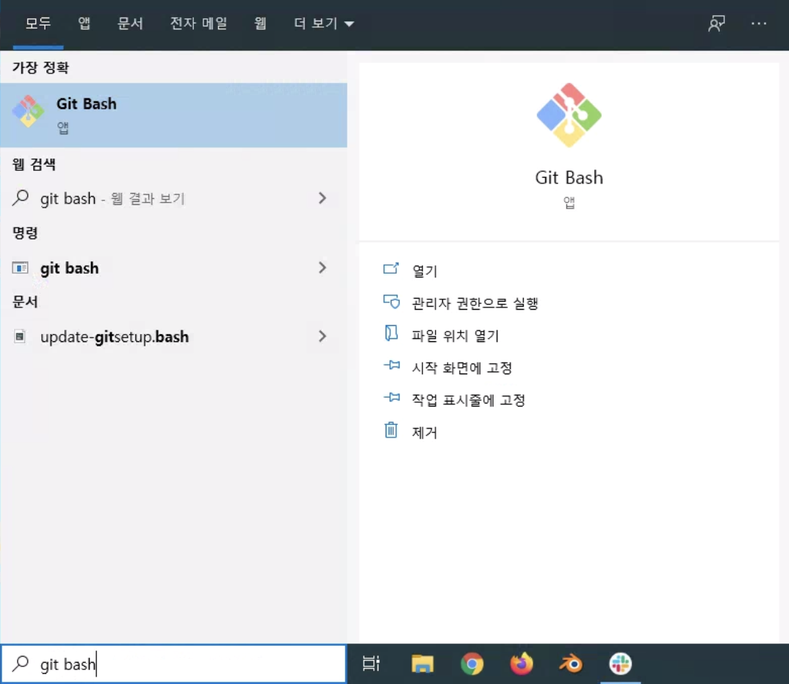
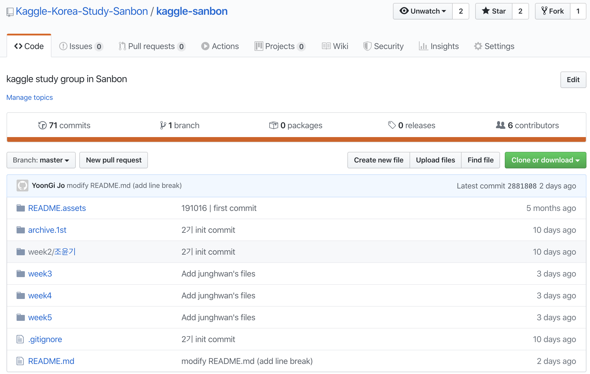
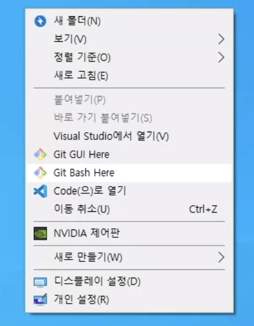
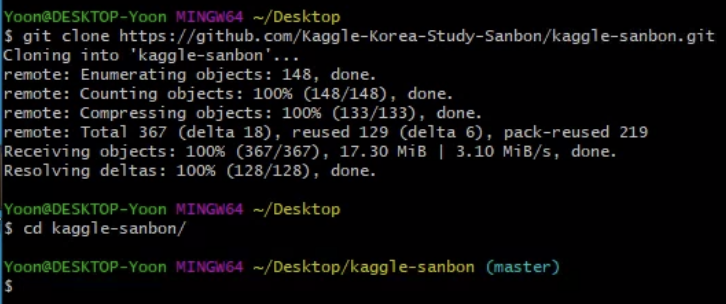
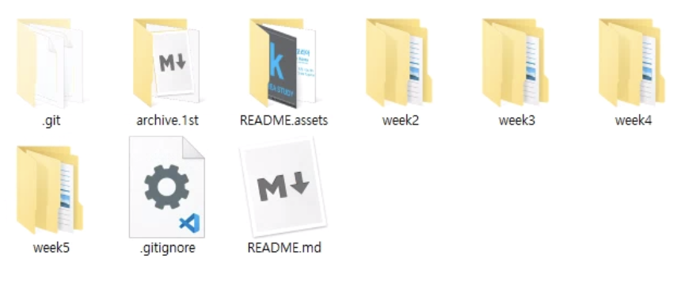
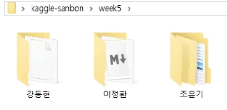
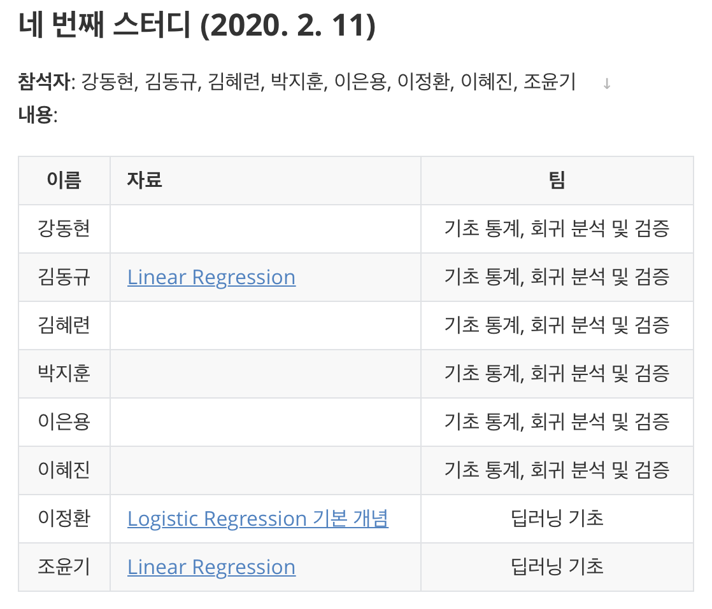

# Git tutorial for sanbon study

  <br>

  <br>

## TL; DR

`Step 1~2` 를 마치고 난 후 본인 작업물을 업로드할 때 `git bash` 에서 아래와 같이 입력합니다.

```bash
$ git pull origin master
```

```bash
$ git add .
```

``` bash
$ git commit -m "적당한 커밋 메세지"
```

```bash
$ git push origin master
```

<br>

<br>

## Step 0. git 설치하기



시작 버튼 누르고 `git bash` 라고 입력합니다.

- Git Bash 앱이 **<u>검색 된다면</u>** Step 1. 로 넘어가시고
- **<u>검색 안 된다면</u>** https://git-scm.com/download/win 주소로 가서 깃을 설치 합니다.

깃 설치법은 구글 검색으로도 좋은 자료들이 많이 있습니다.

<br>

<br>

## Step 1. 깃 저장소 클론하기

먼저 [산본 스터디 깃 저장소 페이지](https://github.com/Kaggle-Korea-Study-Sanbon/kaggle-sanbon)에 들어갑니다.  

<br>



우측의 `Clone or download` 초록색 버튼을 클릭하면 나오는 url 을 복사합니다.  

<br>

깃 저장소를 복제할 경로(ex. 바탕화면)에서 우클릭 후 `git bash here` 를 클릭합니다.



<br>

git bash 창에서

```bash
$ git clone https://github.com/Kaggle-Korea-Study-Sanbon/kaggle-sanbon.git
```

을 입력합니다.

<br>

```bash
$ cd kaggle-sanbon
```

위 명령어를 입력해 복제된 로컬 깃 저장소로 이동합니다.

<br>



위와 같이 프롬프트 끝에 `(master)` 라고 적혀있다면 성공입니다.

<br>

<br>

## Step 2. 깃 config 설정하기

깃을 사용하기 위해선 **최초 1회** 사용자 설정을 해야합니다.

이름은 영어로 입력하시고, 이메일은 깃허브 가입 시 사용했던 이메일을 입력합니다.

```bash
$ git config --global user.name "이름"
```

```bash
$ git config --global user.email mail_id@mail.com
```

<br>

<br>

## Step 3. 공부한 내용 업로드 하기

### Step 3-1. 공부한 내용 로컬 깃 저장소로 복사하기

만약 바탕화면에 복제를 했다면 바탕화면에 `kaggle-sanbon` 폴더가 있을겁니다.

열어보면 이렇습니다.



<br>

여기서 공부한 내용을 업로드 할 때는 공부한 내용을 week 별로 구분하고, 자기 이름으로 폴더를 하나 만들고 그 안에 공부한 내용을 복사해 넣습니다.

**<u>week5 예시</u>**



<br>

### Step 3-2. README.md 업데이트 하기

<u>**Typora 설치 추천**</u>

기본 텍스트 에디터로 마크다운 파일(.md)을 수정해도 되나, Typora 프로그램을 사용하면 더 편리하게 마크다운 작성이 가능합니다. 

README.md 를 포함한 대부분의 마크다운 문서를 Typora 로 작성하곤 하니 설치하는걸 추천드립니다.

Typora 로 README.md 파일을 열면 아래와 같이 깃허브에서 렌더링되는 모습과 동일하게 보이게 됩니다.



<br>

여기서 개인 공부한 내용을 아래와 같이 작성해 업데이트 합니다.

```
[공부한 내용 제목](업로드할 파일 경로)

(4주차 예시)
[Linear Regression](week4/조윤기)
```

업로드할 파일 경로는 README.md 파일을 기준으로 상대 경로로 작성하시면 됩니다.

<br>

### Step 3-3. git 명령어를 이용해 원격 깃 저장소로 푸시하기

`Step 3-2` 까지 진행했다면, `kaggle-sanbon` 폴더(로컬 깃 저장소 최상위 경로)로 돌아가 우클릭 후 `git bash here` 를 클릭합니다.

git bash 창에서

```bash
$ git pull origin master
```

```bash
$ git add .
```

```bash
$ git commit -m "적당한 커밋 메세지 (ex. 20.02.28 윤기 업로드)"
```

```bash
$ git push origin master
```

**`git pull origin master` 는 업로드 전 꼭 실행해 주어야 깃 커밋 히스토리 싱크가 맞습니다.**

<br>

<br>

