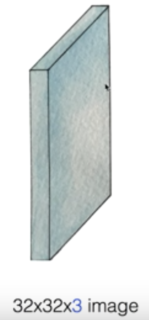

# Lec 11. CNN introduction

 

**CNN (Convolutional Neural Network)**

 

# CNN 원리

## 1. 하나의 이미지에서 시작!

`32 x 32 x 3 (width, height, depth)` 사이즈 이미지라 가정

여기서 depth 는 (**r**ed, **g**reen, **b**lue) 컬러를 의미

 

## 2. 작은 영역에 집중하자

원래 이미지(32x32) 중 작은 영역(5x5) 만 떼어서 생각하자.

이 작은 영역을 **필터**라 부를건데, 필터의 사이즈는 사용자가 직접 정해줄 수 있다.

 

## 3. 필터로부터 '하나'의 숫자만을 만들어내자

### 3-1. 어떻게 하나의 숫자로 만들까?

`5x5x3(75)`개의 숫자를 어떤 방식으로 하나의 값으로 만들까

`5x5x3` 행렬에 대해 multivariable 연산을 했던것 처럼,

`w1x1 + w2x2 + w3x3  ... wnxn + b = ŷ` 으로 필터의 값들로부터 **weight** 를 곱하고 **bias** 를 더해 하나의 값을 구해낸다.

 

### 3-2. 필터로부터 몇 개의 값이 만들어질까?

`7x7` 이미지에 대해 `3x3` 필터일 경우, 한 칸씩 이동하면 다섯 칸 이동 가능해서 **5x5 (25)** 개의 필터, **25**개의 값이 나온다.

여기서 **한 칸씩** 필터가 이동했는데, 이를 `stride = 1` 이라고 한다.

 

<u>**with stride = 2**</u>

stride 가 2일 때는 3 칸씩 이동 가능해서 **3x3 (9)** 의 필터로부터 **9**개의 값이 만들어진다.

 

**<u>일반화</u>**

`input size = N`, `filter size = F` 일 때 이동 가능한 칸 수는 다음과 같이 구할 수 있다.

>  (N - F) / stride + 1

 

**<u>문제점?</u>**

원래 `7x7` 사이즈의 이미지에 대해 `stride=1, filter_size=3`를 적용하면 `5x5` 사이즈의 이미지로 변한다.

→ 필터 적용을 하면 할 수록 원래 이미지 사이즈보다 작은 사이즈가 되고 있는데, 이는 원래 정보를 잃고 있다는 의미.

 

**<u>해결 방법</u>**

**`Padding`** 적용하기!

`7x7` 사이즈 이미지에 **1 픽셀**씩의 패딩을 추가해서 `9x9` 사이즈 이미지로 만든 뒤 필터를 적용하면, output 이 `7x7` 사이즈가 된다.

> (N - F) / stride + 1
>
> (9 - 3) / 1 + 1 = 7

<u>패딩 효과</u>

- output 사이즈를 input 사이즈와 **동일하게** 맞출 수 있다.
- NN 에 이미지의 **가장자리 부분을 인식**시켜주는 효과를 줄 수 있다.

 

## 4. 필터 여러개를 적용하자

필터를 통해 나온 output 을 **activation map** 이라고 하는데, 

같은 이미지에 대해 필터를 여러개 적용해서

`depth`를 가지는 **activation maps** 를 생성한다.

 

## 5. 최종 네트워크 구조

