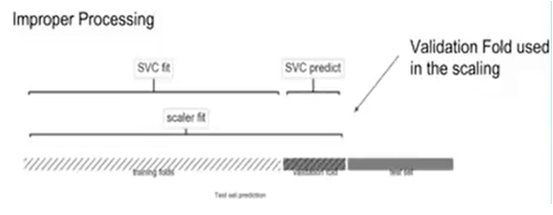

# data leakage

## 1. data leakage?

train 데이터 외의 정보가 모델을 만들때 발생

datak leakge 로 인해 완전히 잘못된 모델이 나오거나, 과적합(overfitting)이 발생함

예측 하려는 target 에 대한 정보를 통해 모델이 학습할 때

## 2. 어떻게 확인?

과적합인지 확인한다. 

70% 정확도의 모델이 갑자기 높은 정확도를 갖게 된다면 data leakage 가 발생했음을 의심해야 한다.

## 3. data leakage 방지

부적절한 과정

적절한 과정

- 처음부터 아예 validation 데이터 셋을 따로 보유한다
- 임의의 노이즈를 추가한다
- leakage 변수를 제거한다
- **scikit-learn 파이프라인 아키텍처를 사용한다**