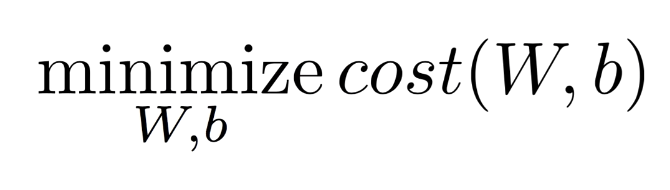

# Lec 02. Linear Regression의 hypothesis 와 cost 설명

## (Linear) Hypothesis

학습(Learning) : Data에 맞는 **선(Hypothesis)**을 하나 찾는 것

## 어느 선(Hypothesis)가 더 좋을까?

실제 값과 가설 함수 H(x) 와의 차이가 적을수록 좋다

## Cost function

**cost function**: 실제 값과 가설 함수 H(x) 와의 차이를 정의한 함수

`H(x) - y ` 보다 `(H(x) - y)^2` 를 더 많이 쓰인다. 왜냐하면,

- 제곱을 취함으로써 오차가 양수/음수 관계없이 항상 양수로 표현 가능
- 오차가 적을 때 보다 컸을 때 더 큰 페널티를 줄 수 있음

일반적으로 이렇게 사용한다.

**`cost = 오차 제곱들의 평균`**

## Summary

**<Linear Regression 의 목표>**

<u>Cost function 최소화하기!</u>

cost 함수는 가설 함수와 실제값 사이 오차 제곱의 평균

여기서 cost 함수는 W 와 b 에 대한 함수로 표현 가능

이제 간단히 표현 해보면,

**Goal : cost 를 최소화하는 W, b 를 구하자!** 

