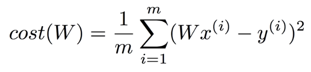

# Lec 03. Linear Regression의 cost 최소화 알고리즘의 원리 설명

## 설명을 위해 hypothesis 간단히

설명을 위해 hypothesis **간단히!**

b 를 제거한다.

## cost(W) 는 어떤 모양일까?

데이터가 아래와 같을 때,

cost(W) 를 대입해서 구해보자

cost(W) 는 아래와 같은 형태를 갖는다

**Linear Regression 의 목표 리마인드**

> cost 를 최소화(minimize)하는 W, b 찾기 !

## Gradient descent algorithm

**"경사를 따라 내려가는 알고리즘"**

Gradient descent algorithm 특징

- cost function 을 최소화한다
- minimization 문제에서 널리 사용한다
- cost(W,b) 에서 cost 를 최소화하는 W 와 b 를 찾는다
- 다른 cost(w1, w2, ...) 함수에도 적용 가능하다

## How it works?

1. 임의의 지점(W,b)에서 시작
2. cost(W,b) 가 감소되도록 W 와 b 를 아주 조금씩 바꾼다
3. 반복
4. **local minimum** 지점에 도달하면 cost(W,b) 가 minimize 된다

## Formal definition

미분 쉽게하기 위해 변환

> 합성함수 미분 리마인드

미분 진행..

위 식을 해석하면...

`next W = current W - cost(W)의 기울기 * ⍺ (learning rate)`

으로 이해하면 된다.

## Gradient descent algorithm 주의점

만약 W, b 에 대한 cost 함수가 위와 같은 형태로 만들어진다면,

initial value(W,b) 에 따라 minimize 된 **<u>cost 함수 값이 다르다.</u>**

그래서 설계한 cost 함수가, **Convex function** (밥그릇 형태의 함수)의 모양을 띄는지 보장이 되어야 Gradient descent algorithm 이 제대로 동작한다.

> Convex function 형태에서는 Initial Value 에 관계없이 항상 같은 지점으로 경사 하강한다.

