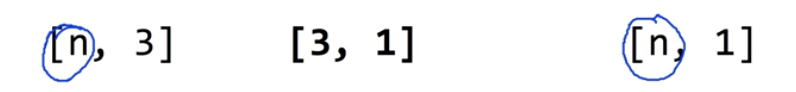

# Lec 04. Multi-variable linear regression

## 여러개의 input 데이터에서의 regression

어떻게 Hypothesis function 을 설계할까?

위와 같이 변수 3개를 추가해 H(x₁, x₂, x₃) 을 만들면 된다.

이때 cost function 은 아래와 같이 표현 가능하다.

## Hypothesis using matrix

multi-variable 문제에서 hypothesis 는 위와 같이 표현 가능!

w₁x₁ 과 x₁w₁ 은 사실 같은데, 행렬 연산에서는 교환 법칙이 성립하지 않으므로 일반적으로 H(X) 를 나타낼 때 `H(X) = XW` 로 표현한다. 대문자는 행렬(Matrix) 를 의미한다.

> 만일 instance(데이터 하나하나를 의미)가 많다면 행렬 연산을 여러번 해야할까?

답은 No

행렬을 사용함으로써 instance 각각 계산할 필요 없이 한번에 연산이 가능하다.

**해석**: 

5개 데이터(instance), 3개의 variable, 각 variable 에 맞춰 조정되는 weight 3개로

[5x1] 사이즈의 Hypothesis 함수 만듦.

## Summary

데이터(instance) 수는 가변하므로 n(None)으로 표현한다.

`[n, 3] * [3, 2] = [n, 2]`

이전 강의에서는 `H(x) = Wx + b` 로 표현했었는데,

`H(x) = xW + b` 로 표현해야 tensorflow 에서 바로 행렬 연산을 적용할 수 있다. **<u>(수학적으론 동일한 식이다)</u>**

