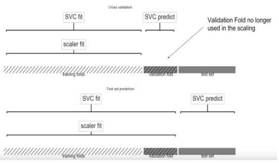

# Data Leakage

 

## Introduction

Data Leakage는 target 데이터에 대한 정보를 train 데이터가 포함하고 있을때 발생합니다. 

Data Leakage는 train 및 validation set에 대해 모델이 높은 점수를 갖도록 하지만, 실제 prediction(test set)에 대해서는 낮은 성능을 갖도록 합니다.

Data Leakage는 **target leakage** 와 **train-test contamination** 두 가지 종류가 있습니다.

 

 

### 1. Target Leakage

**Target leakage** 는 모델이 학습할때 사용하는 변수가 실제 예측할 시점에는 사용할 수 없는 변수일때 발생합니다.

예를 들어, 폐렴을 걸릴것인지 예측하는 모델을 만든다고 해봅시다.

| got_pneumonia | age  | weight | male  | took_antibiotic_medicine |
| ------------- | ---- | ------ | ----- | ------------------------ |
| False         | 65   | 100    | False | False                    |
| False         | 72   | 130    | True  | False                    |
| True          | 58   | 100    | False | True                     |

여기에서 `got_pneumonia` 가 `target` 입니다.

train set에서 `took_antibiotic_medicine` 변수는 `target` 인 `got_pneumonia` 와 상관 관계가 높아 보입니다. 그러나 이는 train 데이터가 만들어질 당시 **'폐렴에 걸리지 않은 사람은 항생제를 복용하지 않았다'** 는 관계에 의한 것입니다. **'현재 항생제 복용 여부'** 는 **'미래의 폐렴 감염 여부'**를 결정하지 않습니다.

만약 이 train 데이터로 모델이 학습할 경우, `got_pneumonia` 와 `took_antibiotic_medicine` 사이의 강한 상관 관계를 가지고 학습할 가능성이 있습니다. 이렇게되면 train 데이터(validation 데이터를 포함한) 안에서는 **모델이 높은 성능을 보이지만**, 미래의 test 데이터를 예측할 때는 `took_antibiotic_medicine` 변수가 의미있는 영향을 주진 않을것입니다.

이러한 Target leakage를 예방하기 위해 `target`이 결정된 이후 업데이트 되는 변수들은 학습에서 제외되어야 할 것 입니다.

 

### 2. Train-Test Contamination

**Train-Test Contamination**은 train 데이터를 validation 데이터로부터 제대로 분리하지 않았을 때 발생합니다.

예를 들어, 전처리 작업 중 `scaling` 을 한다고 생각해봅시다.

만약 `scaling` 할 때, train 데이터와 validation 데이터를 분리하기 전에 `min-max scaler` 를 사용해 `fit` 했다면, 이를 **train-test contamination** 이 발생했다고 말합니다.

결론부터 말하자면, train 데이터와 validation 데이터를 함께 묶어서 `fit` 하면 안된다는 것입니다. 그렇지 않으면 validation 데이터의 분포/정보가 train 데이터로 **오염** 될 수 있고, 그러면 새로운 데이터에 대해 일반화할 수 없는 모델이더라도 특정 데이터에 대해서는 잘 동작할 것입니다.

- 잘못된 전처리 예 (validation set 도 함께 fit)

- 올바른 전처리 예 (validation set 나눠서 fit)

이러한 Train-Test Contamination 을 예방하기 위해 train/validation/test split 을 확실히 하거나, **pipeline** 안에 전처리 과정을 포함시키는 방법이 있습니다.

 

 

## Conclusion

**Data leakage** 는 모델이 잘못된 예측을 하도록 만들고 이는 이 모델로 구현된 제품에 많은 손해를 발생시킬 수 있습니다.

이를 방지하기 위해

- **target leakage :**
  - target leakage 가 발생할 만한 변수를 찾기 위해 EDA 잘하기

- **train-test contamination :**
  - train-validation 구분을 확실히 한 후에 전처리 시행하기
  - pipeline 사용하기