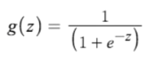
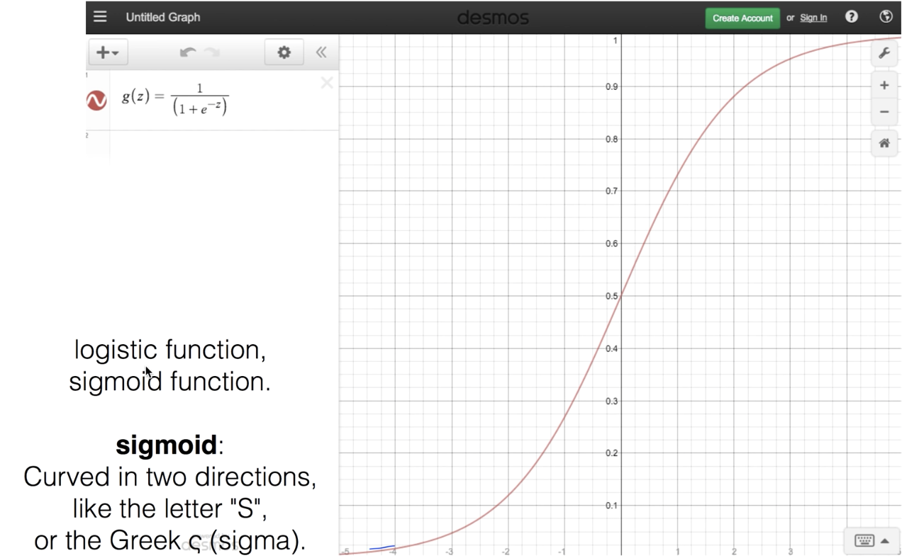

# Lec 05-1. Logistic Classification 의 가설 함수 정의


## (binary) Classification ?


이러한 problem 을 처리하기 위해 encoding 필요하다

- Spam(1), Ham(0)
- show(1), hide(0)
- legitimate(0), fraud(1)


## Classification -> Linear Regression?


classification 을 linear regression 으로 표현할 수 있으나, 만약 x 값이 엄청나게 커지면 제대로 학습하지 못하는 결과가 나오기도 한다.

> ex)
>
> x: 100 hours --> H(x) = 1/101x
>
> 이 가설 함수에서 4 hours 일 때는 H(4) = 0.039 ≅ 0 이게 되므로 fail 로 predict 하게된다


## sigmoid function

**<u>sigmoid (g) 정의:</u>**





logistic 함수 또는 sigmoid 함수라고 부른다.

"S" 자 커브를 갖는 것이 특징!


이제 x 값에 따라 무한히 증가/감소 하던 H(X) 를 sigmoid 함수를 이용해 0과 1 사이의 함수로 변환할 수 있다.

기존 H(X) 를 z 로 두고,

`z = XW`

sigmoid 함수를 취한  g(z) 를 새로이 H(X) 로 정의하면,

`H(X) = g(z)`

H(X) 는 최소 0, 최대 1을 갖는 함수가 된다.


## Summary

**<u>Logistic Hypothesis</u>**


sigmoid 를 취해 새롭게 정의된 가설 함수.


---


# Lec 05-2.  Logistic Regression의 cost 함수 설명


## Problem

Logistic Regression 에선 가설 함수가 바뀌었다


그래서 cost 함수의 모양이 달라졌다

- 좌측: 직선 `Wx + b` 를 `H(x)` 로 사용한 `cost(W,b)`
- 우측: `sigmoid` 함수를 `H(X)` 로 사용한 `cost(W)`


우측 `cost(W)` 에서는 울퉁불퉁한 그래프 모양을 취하기 때문에, gradient descent algorithm 이 제대로 동작하지 못하고 일부 Local Minimum 에서 결과를 도출해내곤 한다.

**cost가 최저점이 아닌데도 불구하고 학습이 더 진행되지 않는 문제 발생!**


## New cost function fot logistic


cost 함수를 c 함수를 이용해 새롭게 정의하자.


- 좌측: `Cost = -log(H(x))` (y label = 1 일때)
  - H(x) 가 1 일때, Cost = 0
  - H(x) 가 0 일때, Cost = ∞
- 우측: `Cost = -log(1-H(x))` (y label = 0 일때)
  - H(x) 가 0 일때, Cost = 0
  - H(x) 가 1 일때, Cost = ∞


## Summary


y label 0/1 에 따라 나누던 if condition 정리하면,


위 식으로 정리할 수 있다.

그래서 logistic regression 에서의 Cost function 은,


이렇게 된다!

**<u>in tensorflow...</u>**

``` python
# cost function
cost = \
tf.reduce_mean(
  -tf.reduce_sum(Y*tf.log(hypothesis) + (1-Y)*tf.log(1-hypothesis))
)
```

