# Lec 06-1. Softmax Regression 기본 개념 소개

## Multinomial classification

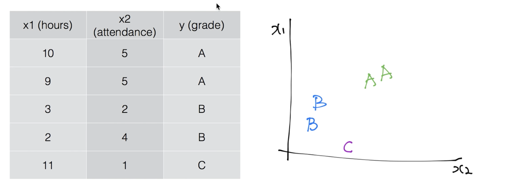

3개의 class 를 가진 classification 문제를,

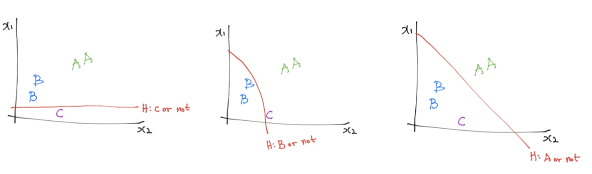

3개의 binary classification 으로 표현 가능하다.

- A or not A
- B or not B
- C or not C

이 3개의 classification 을 그림으로 표현하면,

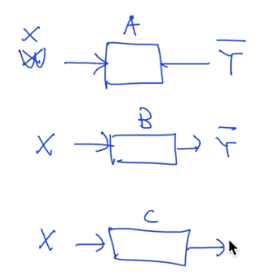

위와 같이 표현된다.

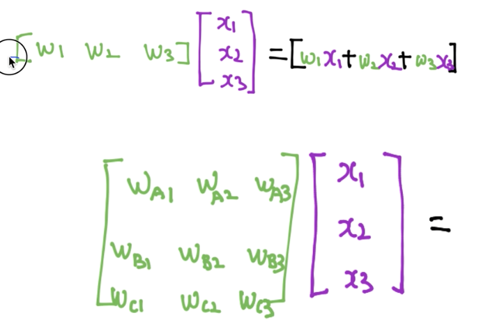

Ha(X), Hb(X), Hc(X) 3개의 독립된 classification 문제로 분해할 수 있고, 각각의 Ha(X), Hb(x), Hc(X)를  Matrix를 사용해 하나로 합칠 수 있다.

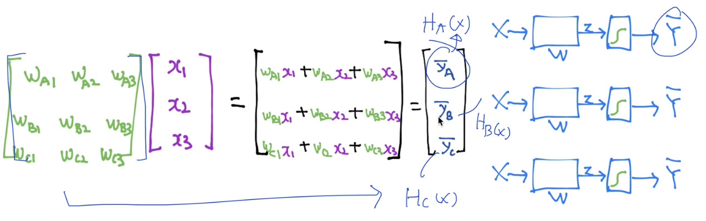

이렇게 나온 Yhat_A, Yhat_B, Yhat_C를 sigmoid 를 취해주면 된다.

---

# Lec 06-2. Softmax classifier 의 cost 함수

## Where is sigmoid in multinomial classification

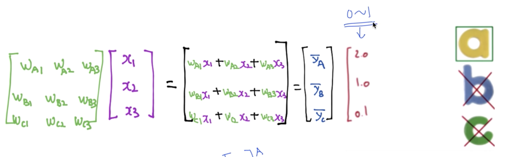

Yhat A, B, C 값이 각각 2.0, 1.0, 0.1 이 나왔으니 최종 predict 는 A 가 되지만, sigmoid 는 없는 상태.

## Softmax function

### Sigmoid 와는 다르다

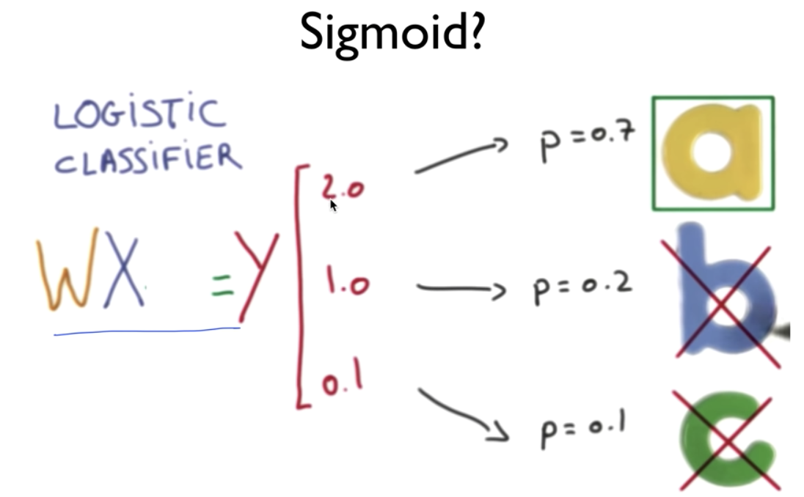

**<u>sigmoid 처럼</u>** 결과값을 0에서 1 사이 값으로 만들어준다. (sigmoid 는 아니다. sigmoid 는 직선 하나를 변환시켜줬음)

### Softmax function 특징

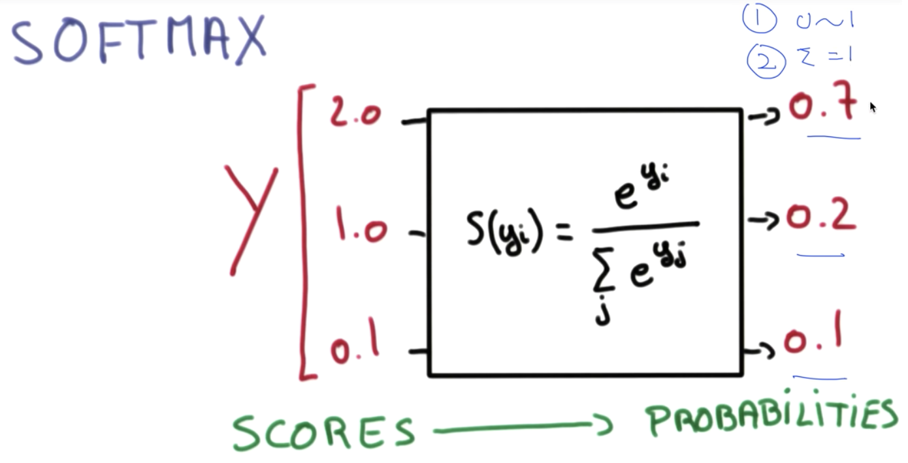

- y score 를 0~1 값으로 만들어준다
- 변환된 score 값을 모두 합하면 1이다. **<u>(확률)</u>**

### One-Hot Encoding

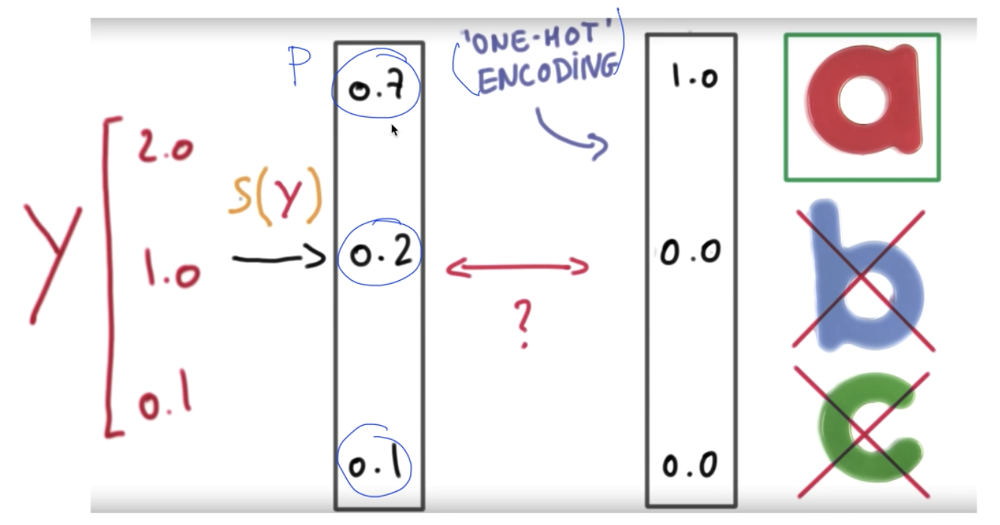

Softmax function 를 빠져나온 값은 곧 확률값이니까, 가장 큰 확률을 갖는 label 이 곧 **prediction**이 된다.

그래서 가장 큰 값을 1, 나머지 값을 0으로 만드는 One-Hot Encoding 을 하면 깔끔하게 prediction 을 구할 수 있다.

## Cost function

위에서 softmax 를 취한 `S(y)`가 Hypothesis 함수가 되는데, 이 Hypothesis 함수에 대한 Cost 함수를 구해보자.

### Cross-Entropy cost function

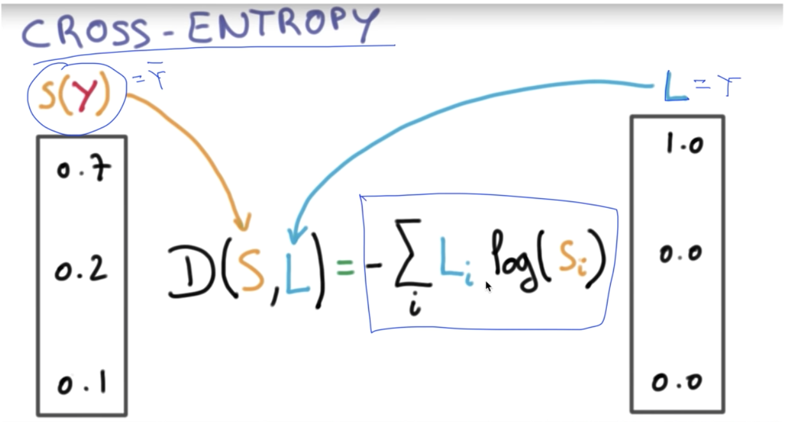

새 cost function은 `S(y)` 에 로그를 취한 값과 실제값 L 을 element wise 곱(행렬곱 아님)한 후 더한 값을 cost 로 갖는다.

이를 간단히 대입해보며 이해해보자

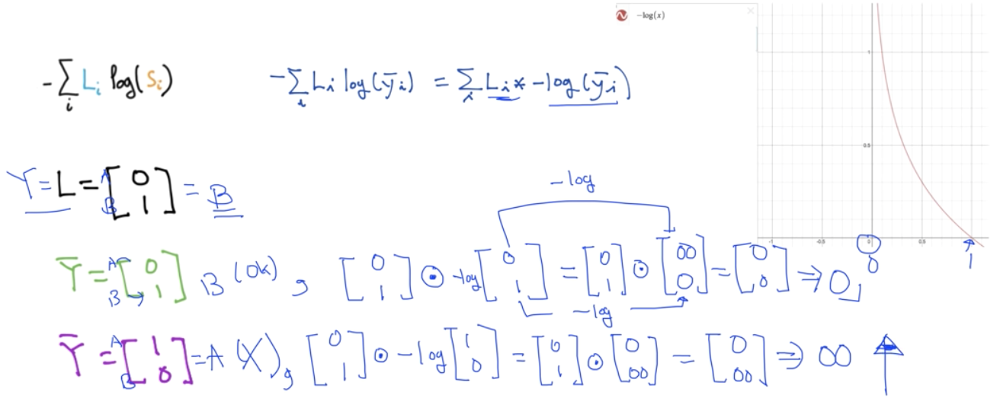

실제값이 [0,1] (B) 일때, Hypothesis 값이 [0, 1] (B) 로 정답일때 cost 는 0이어야 한다.

정의된 cross-entropy function 에 대입해보면 cost는 0이 나온다.

마찬가지로 Hypothesis 값이 [1,0], 즉 A 로 예측했을 때 cost 는 커져야하고 실제로 대입했을 때 cost 는 무한대가 된다.

여기서 Hypothesis 값은 확률값이기 때문에 [1,0] 일 수도 있지만 대체로 1보다 작고 0보다 큰 값으로 이루어져 있을 것.

## Summary

지난 `Lec 05` 에서 배운 **<u>Logistic cost</u>** 함수는 사실 이번 시간의 **<u>Cross-entropy cost</u>** 함수와 동일한 식이다.

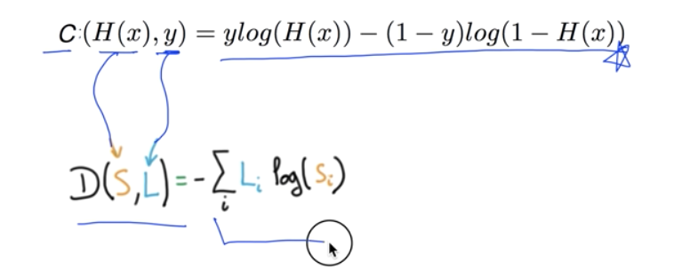

왜냐하면 L 을 표현할 때 one-hot 인코딩으로 1 또는 0의 값으로만 표현되기 때문에,

결과적으로 1 또는 0의 값만 갖던 binary classification 의 **<u>logistic cost function</u>** 과 동일한 의미이다.

