# Lec 7-1. Learning rate, Data preprocessing, Overfitting

 

## 1. Learning rate

### large learning rate: overshooting

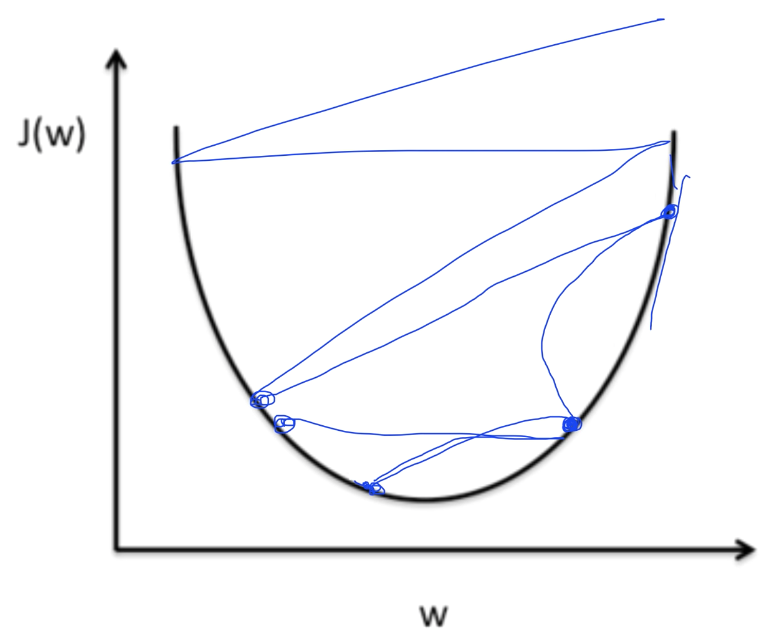

learning rate 가 너무 크면 cost가 무한대 값으로 나갈 수 있다.

 

### small learning rate: takes too long, stops at local minimum

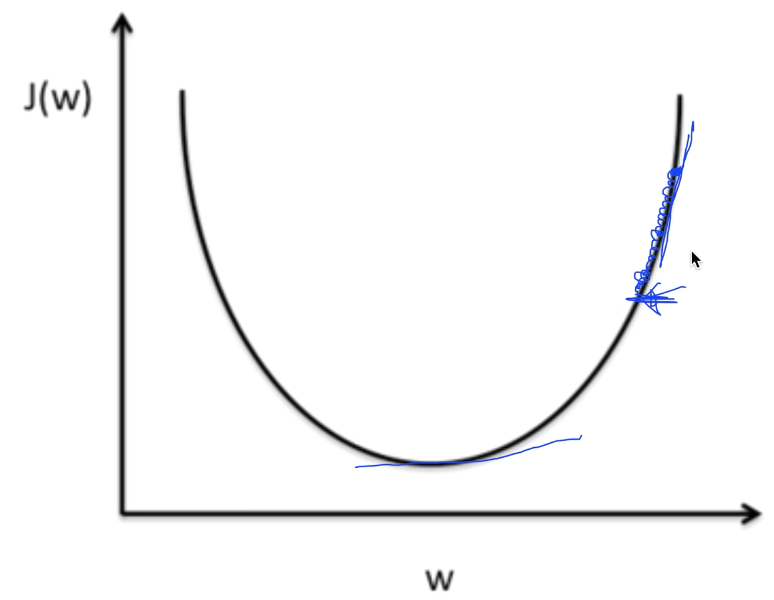

learning rate 가 너무 작으면 학습 시간이 오래걸리고, local minimum에서 학습이 끝날 수 있다.

 

### gradient descent at large/small learning rate

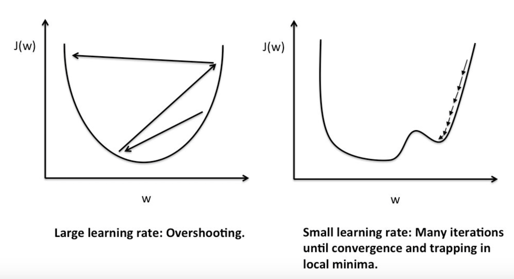

 

### 결론

learning rate 가 적절한 수준인지 확인하려면, 

직접 학습을 시켜보고 cost가 적정 수준으로 감소하는지 확인하는 과정을 거쳐야한다.

 

 

## 2. Data preprocessing

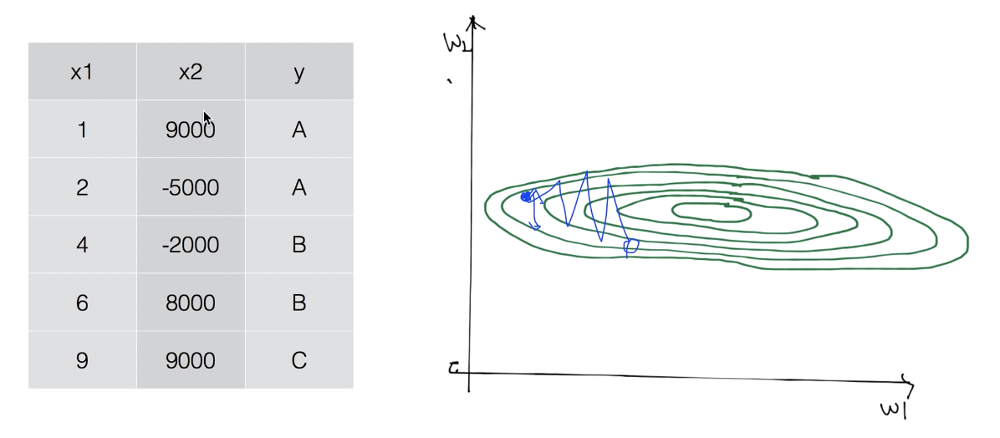

변수간 숫자 차이가 크면 cost function 그래프가 고르지못하고 치우쳐진 형태로 그려진다.

그러면 학습 시 global minimum에 도달하지 못하고 **튕겨나갈 수 있다**.(overshooting)

때문에 변수 간 **<u>normalize</u>**가 필요하다!

 

### Normalize

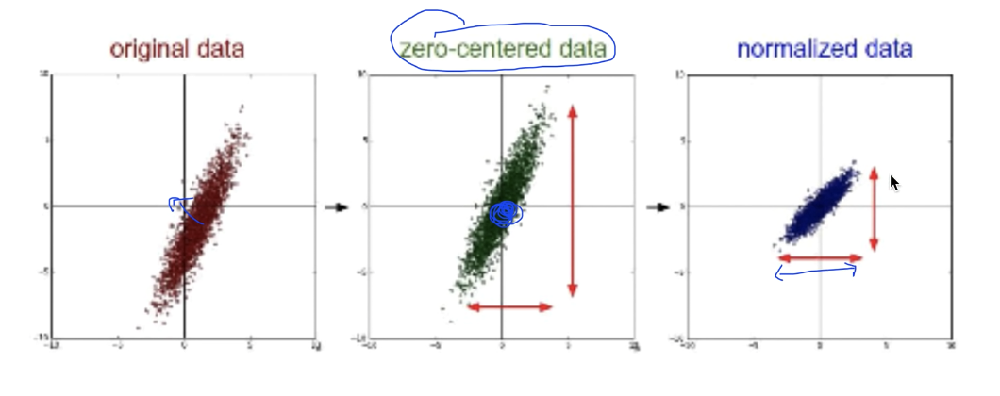

- zero-centered : 데이터의 중심을 0에 맞추기
- normalized : 데이터의 중심을 0에 맞추고 값 전체 범위를 제한하기

 

#### Standardization (표준화)

<u>Normalization 방법 중의 하나</u>

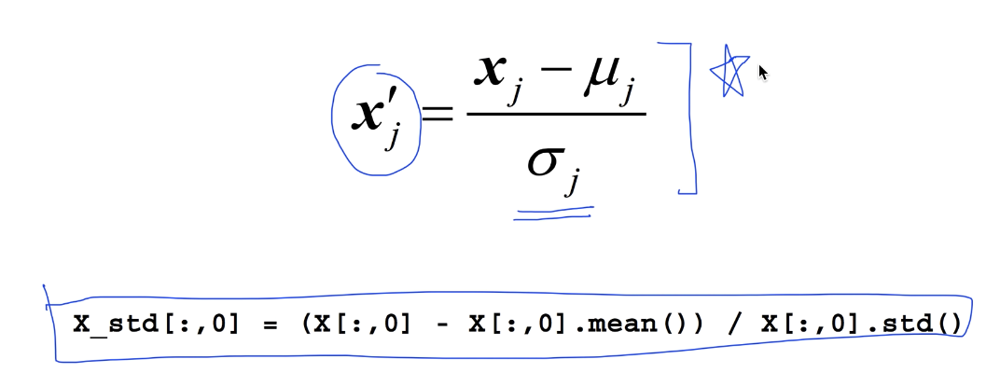

 

 

## 3. Overfitting

학습 데이터에 **<u>너무</u>** 딱 잘맞는 경우. 실제 테스트 데이터에 대해선 성능이 좋지 못하다.

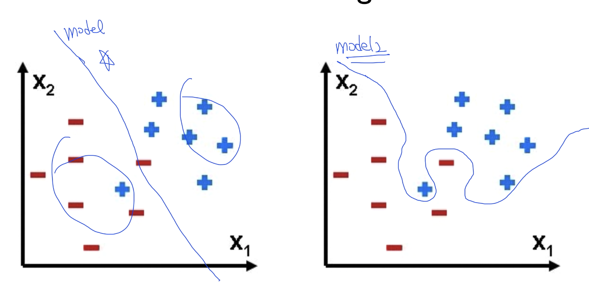

좌측 모델이 더 일반적이고 좋은 모델.

 

### overfitting 을 줄이는 방법

- 더 많은 학습 데이터 확보하기
- feature 수 줄이기
- **Regularization (일반화)**

 

### Regularization

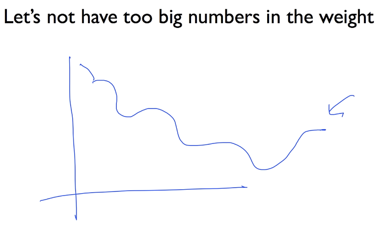

모델들이 예측 선을 그릴 때 너무 구부리지 말고 펴게 해주자!

 

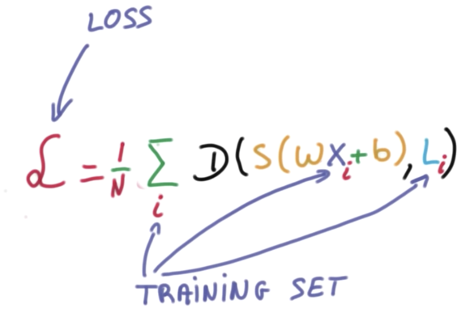

기존 cost 함수 뒤에,

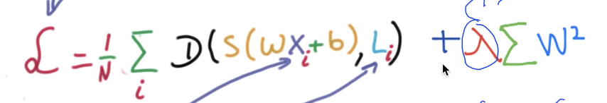

위 term 을 추가해준다.

일반적으로 w의 제곱들의 합을 더해준다.

앞의 상수(람다)는 `regularization strength` 라고 하며,

- 0일 경우 regularization 을 사용하지 않겠다는 뜻
- 1일 경우 regularization 을 중요하게 적용하겠다,
- 그 외 0~1 사이 값을 설정해 regularization 을 적용하려는 정도를 정할 수 있다.

 

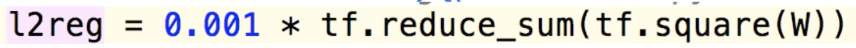

텐서플로에서는 위와 같이 표현 가능 (`l2reg`를 `cost`에 더해주기만 하면 된다.)

 

 

---

 

 

# Lec 07-2. Training/Testing 데이터 셋

 

## Evaluation using training set?

Training 데이터셋을 통해 학습하고 동일한 데이터셋으로 Evaluation 한다?

--> **잘못된 방법**

> 한번 시험을 보고, 동일한 문제로 다시 시험을 보는 격.
>
> 아마 이 모델은 training 데이터셋의 답을 기억하고 있을 것이며 당연히 높은 성능이 나올 것이다.

 

### train-test split

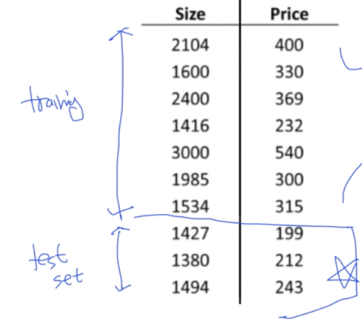

일반적으로 7:3 비율로 나눠한다.

 

### train-valiadation-test split

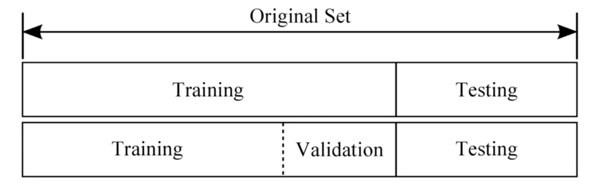

모델을 training 셋에 대해 학습시키고, validation 셋을 **튜닝** 하는 데 사용한다.

 

### Online learning

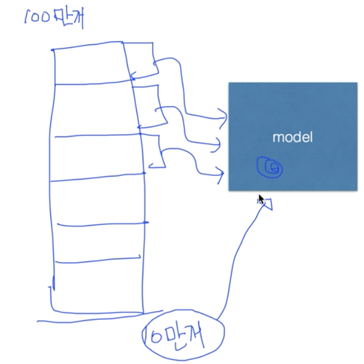

방대한 데이터셋을 학습할 때, 전체 데이터셋을 한번에 학습시키지 않고 하위 데이터셋으로 쪼개서 학습시키는 방법.

모델에는 이전 학습 정보가 남아 있어야 하고, 새 데이터셋에 대해 학습할 때마다 조금씩 변화시킨다.

