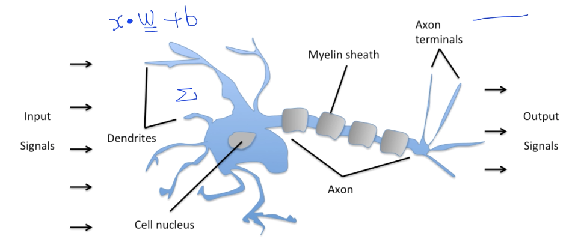
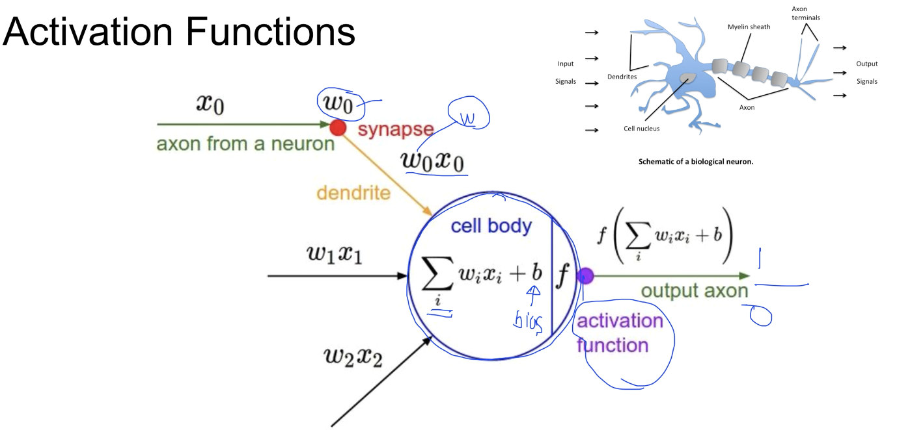
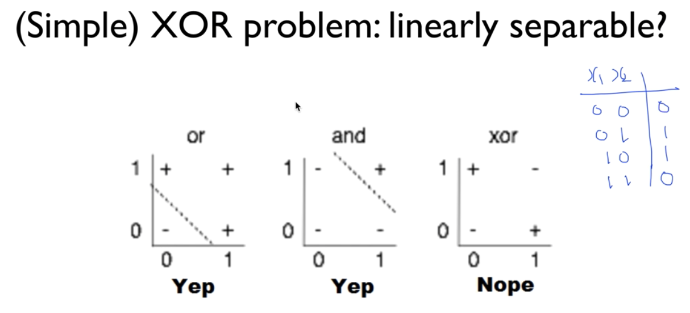
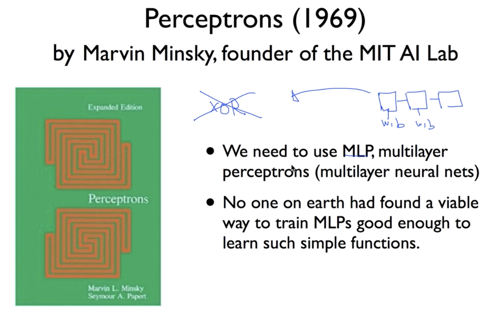
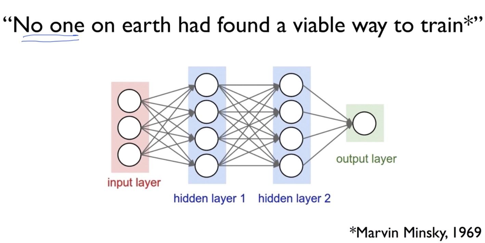
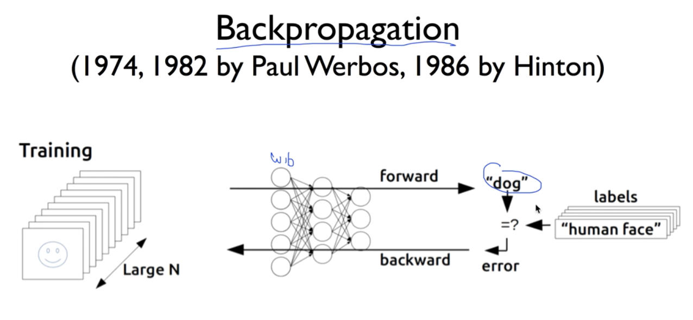
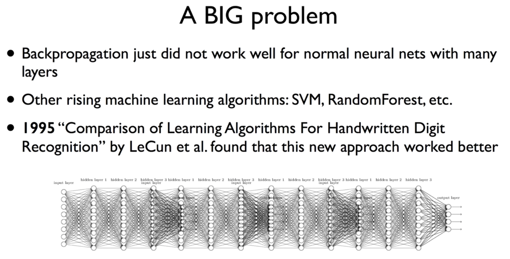
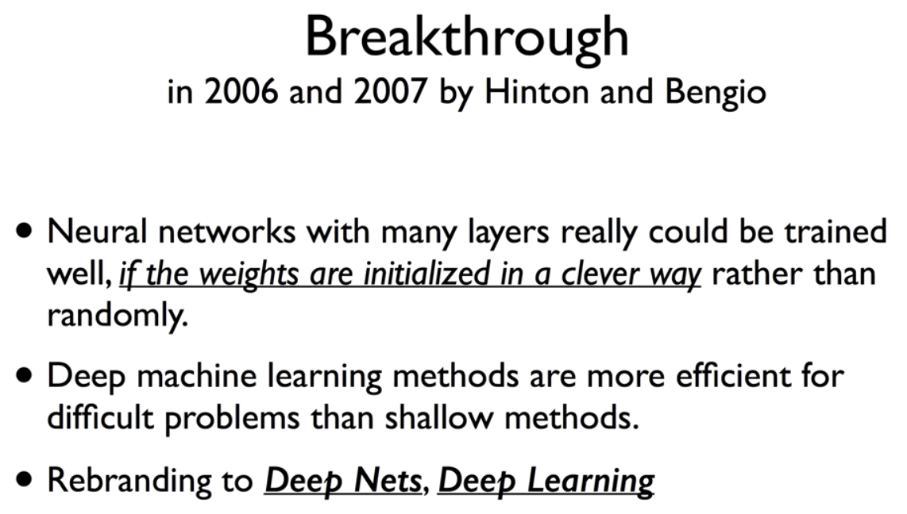
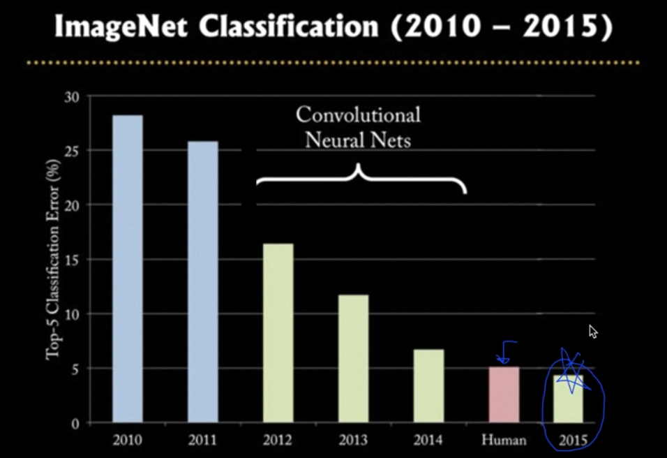
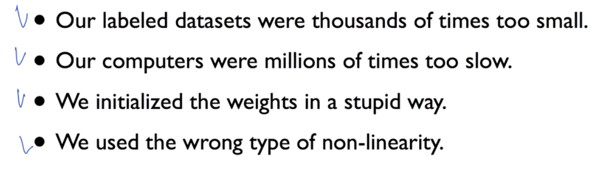

# Lec 08-1. Deep learning start: XOR problem

 

## Activation function

우리 뇌처럼 생각하는 AI 를 만들기 위해 뇌를 탐구해 봤다.

뇌 속의 뉴런 작동 방식: `input signal` 을 받아 일정 수치 이상이 되면 **<u>활성화</u>**되고 `output signal`을 보낸다.

 

이 뉴런 작동 방식을 수학적으로 유사하게 구현할 수 있었는데, 위 다음과 같다.

1. input data `x` 들에 대해 `w` 들을 곱해주고 이들을 합한다.
2. 그리고 그 값을 `activation function` 에 넣는다.
3. `activation function` 내에서 그 값이 일정 수치 이상이면 1(**활성화**)를 리턴하고
4. 일정 수치 미만이면 0(**비활성화**)을 리턴하도록 한다.

 

## XOR problem

 

Minsky 교수가 "**<u>MLP(Multi Layer Perceptron)</u>** 을 이용하면 XOR 문제를 풀 수 있지만, **<u>이 MLP 를 학습시킬 방법이 존재하지 않는다...</u>**" 고 선언!

신경망 알고리즘은 침체기에 접어든다..

 

### Backpropagation

이후 시간이 지나 MLP를 학습시킬 방법을 찾아낸다.

Backpropagation 알고리즘을 통해 이제 MLP 를 효과적으로 학습시킬 수 있게 되었고

XOR 문제뿐 아니라 Convolutional Neural Network 등을 사용해 다양한 문제에 접목시킬 수 있게 되었다.

 

 

## 그런데 또 문제...

복잡한 문제를 해결하기위해 신경망 층을 늘려 해결하고자 했는데, backpropagation 시 error를 뒤로 보낼 때 input layer 층에 도달해서는 값이 너무 작아지는 문제(**vanishing gradient**) 발생

> 다중신경망으로 복잡한 문제에 접목이 힘들어지고 이 시기에 SVM, RandomForest 등 간단하지만 강력한 알고리즘이 발견돼 신경망 알고리즘은 다시 침체기에 접어든다 ㅜㅜ

 

 

# Lec 08-2. Deep Learning

두 번째 침체기를 맞은 신경망 알고리즘은 2006, 2007년 Hinton 교수와 Bengio 교수의 논문으로 해결 방법을 찾는다.

신경망 층이 많아질 수록 학습이 어려웠는데, 이때 weight의 초기값을 **<u>clever way</u>**로 초기화한다면 **vanishing gradient** 문제를 해결할 수 있다고 함.

이당시 두 번의 침체기를 맞은 신경망 알고리즘은 'Neural Network' 란 단어가 들어간 논문은 그냥 reject 되곤 했는데 그래서 이때 신경망 대신 '딥러닝' 이라는 이름으로 바꿨다고 한다.

 

이제는 사람보다 더 잘 맞추는 모델이 나온다.

 

 

## 왜 이전에는 잘 안됐었을까?

이 4가지는 이후 강의에서 더 자세히 다룬다.

