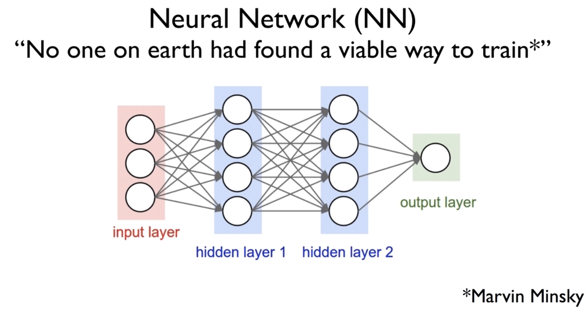
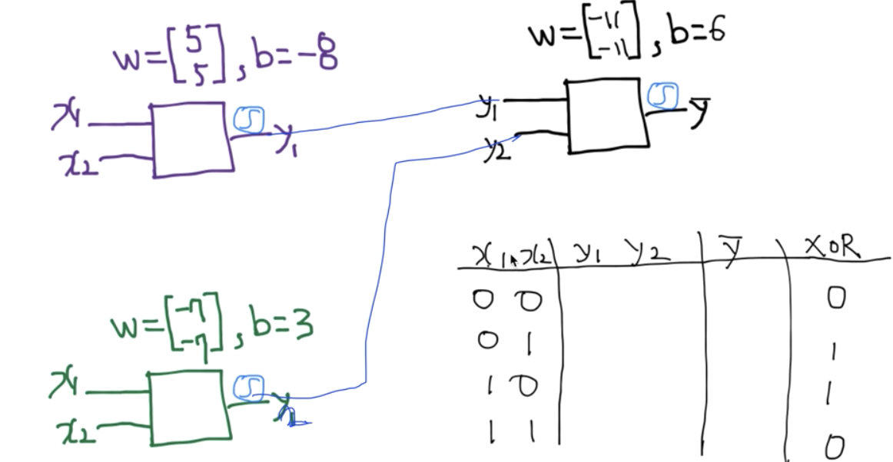
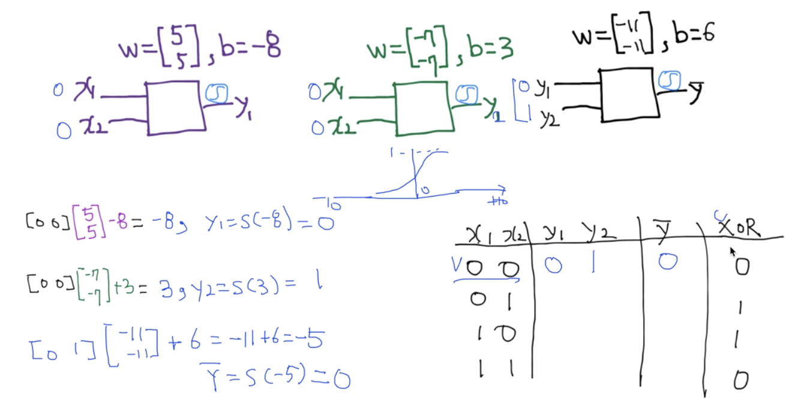
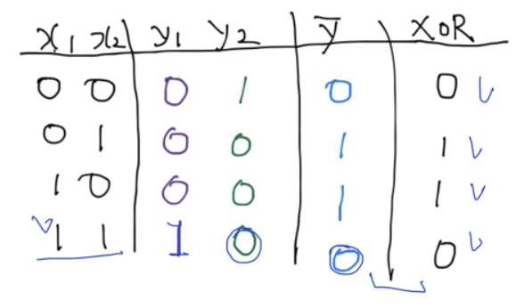
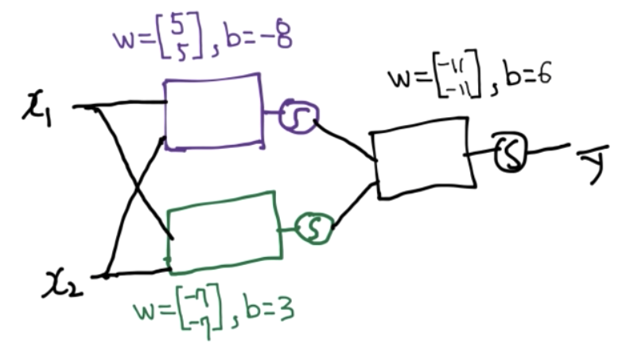
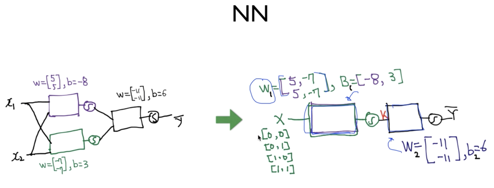
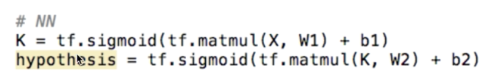

# Lec 09-1. XOR 문제 딥러닝으로 풀기

 

## XOR using NN

Marvin Minsky 교수가,

**<u>MLP(Multi Layer Network)로 XOR 문제 해결은 가능하다고 했다. (다만 이 MLP를 학습시킬 좋은 방법이 없다고 함)</u>**

그럼 3개의 네트워크를 구성해보자.

 

그리고 `x1` `x2` 하나씩 넣어가며 `y_hat`을 구해보자

(최종)

 

위 네트워크를 도식화하면 아래와 같이 나타낼 수 있다.

 

위 그림을 이전 강의에서 배웠던 행렬 연산을 활용해 하나의 유닛으로 합칠 수 있다.

- K(X) = sigmoid(XW_1 + B_1)
- Y_hat = H(X) = sigmoid(K(X)W_2 + B_2)

## How can we learn W1, W2, B1, B2 from training data?

Minsky 교수는 안된다고 했다.

하지만 이후 발견된 backpropagation 알고리즘으로 학습할 수 있다!