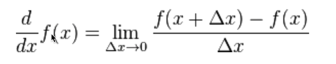
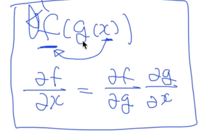

# Lec 09-2. 특별편: 미분 정리

backpropagation 이해를 위해 필요!

 

## Basic derivative

`f(x) 변화량 / x 변화량` 인데, x 가 0 으로의 극한값이니 **순간 변화율** 이 된다.

 

x에 작은 값, 예를 들어 0.01 을 넣어 계산해보자

- f(x) = 3 
  - df/dx = 0
- f(x) = x
  - df/dx = 1
- f(x) = 2x
  - df/dx = 2

 

 

## Partial derivative (편미분)

미분하지 않는 변수는 **<u>상수 취급</u>**

- f(x) = 2x
  - df/dx = 2
- f(x,y) = xy
  - df/dx = y
- f(x,y) = xy
  - df/dy = x
- f(x,y) = x+y
  - df/dx = 1
- f(x,y) = x+y
  - df/dy = 1

### chain rule

f(g(x)) 를 x 에 대해 미분할 때

`df/dx = df/dg * dg/dx` 로 표현 가능하다.

 

