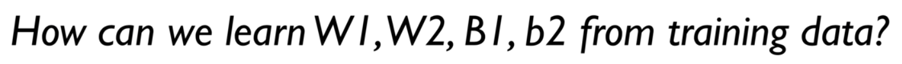
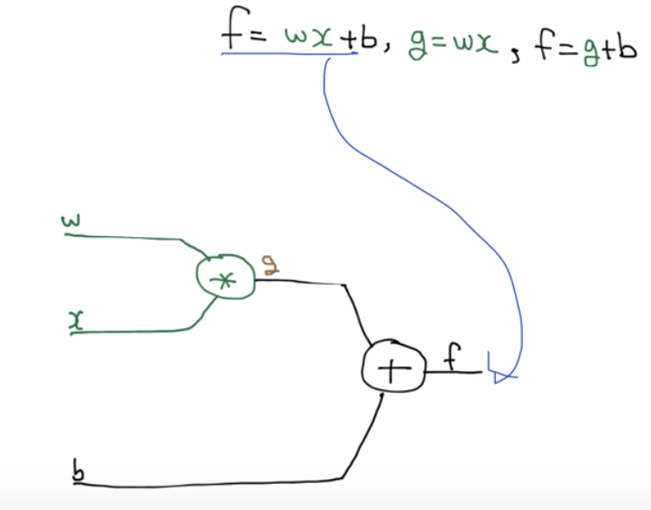
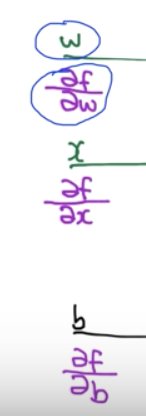
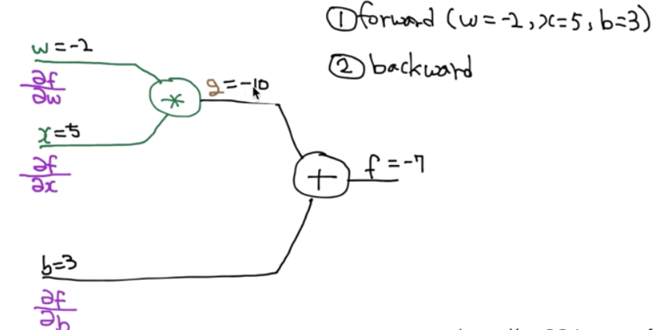
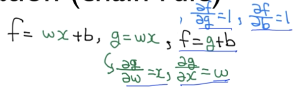
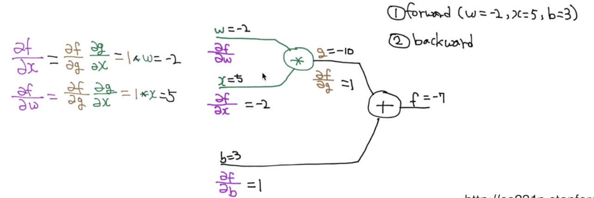
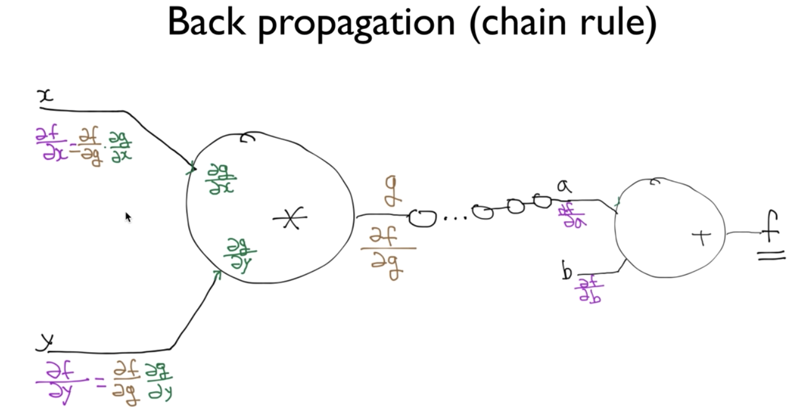
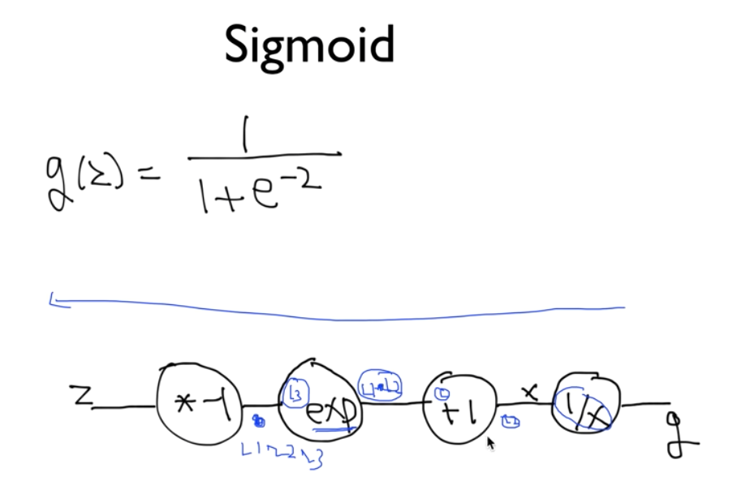
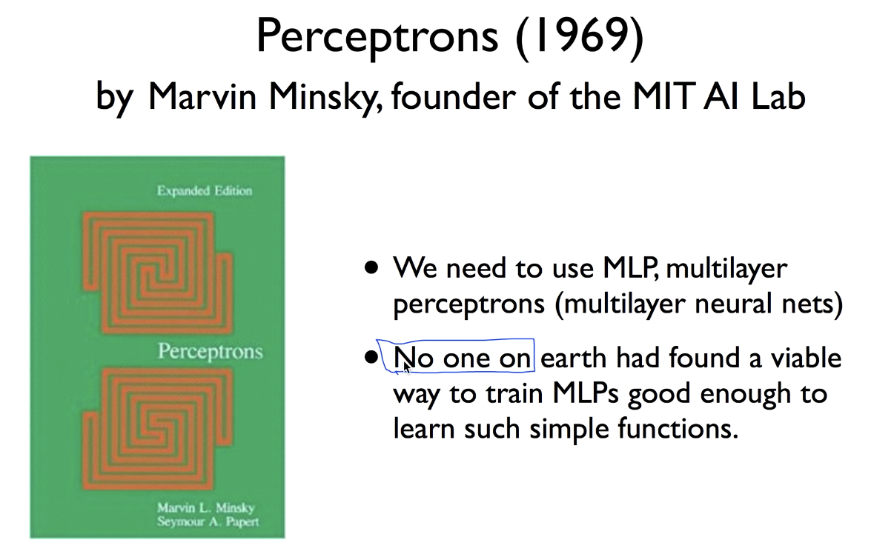

# Lec 09-3. Deep Network 학습시키기 (backpropagation)

> "Minsky 교수가 안된다고 했었는데, 도대체 어떻게 학습시킬 수 있는 것일까?"
>
> --> Backpropagation 알고리즘으로 해결!

 

## Backpropagation

- f = wx + b  **(hypothesis)**
- g = wx

`f = g + b` 로 표현 

각 input 부분이 최종 hypothesis (f) 에 미치는 영향을 알고 싶으면,

각 변수에 대한 변화율을 구하면 된다. (= 편미분!)

 

**<u>forward</u>**

`w=-2, x=5, b=3` 일 때 **hypothesis** 구하기

 

**<u>backward</u>**

`w=-2, x=5, b=3` 일 때 **hypothesis** 에 대한 각 `w`, `x`, `b` 의 영향력 구하기

여기서 기본적인 미분값 term 들은 미리 계산해보자

**`g = wx` 일 때**

- g 함수를 w 에 대해 편미분
  - dg/dw = x
- g 함수를 x 에 대해 편미분
  - dg/dx = w

**`f = g + b` 일 때**

- f 함수를 g 에 대해 편미분
  - df/dg = 1
- f 함수를 b 에 대해 편미분
  - df/db = 1

이렇게 기본 미분 term 들을 미리 계산해 둘 수 있기 때문에 빠르게 미분값 계산이 가능하다

예를 들어, **hypothesis** 에 대한 `w` 의 영향력(미분값)은 `df/dw` 이다

`df/dw = df/dg * dg/dw` 로도 표현 가능하므로,

`df/dw = 1 * 5` 이다.

> 여기서 `df/dw` 가 *5* 라는 의미는, w 가 *1* 만큼 변화할 때 **hypothesis** 를 5만큼 변화시킨 다는 의미!

 

*계산 완료*

 

이제 레이어가 많아도 문제 없다.

 

### sigmoid backpropagation

복잡한 연산에 대한 backpropagation 미분도 chain rule 을 통해 쉽게 계산할 수 있다.

 

 

**backpropagation 알고리즘을 이해함으로써 Minsky 교수가 불가능하다고 했었던 MLP 에 대한 학습을 할 수 있게 되었다**

