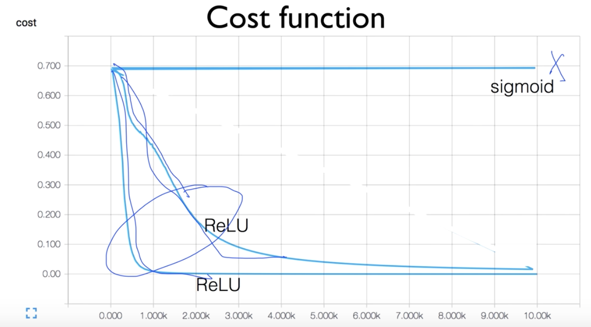
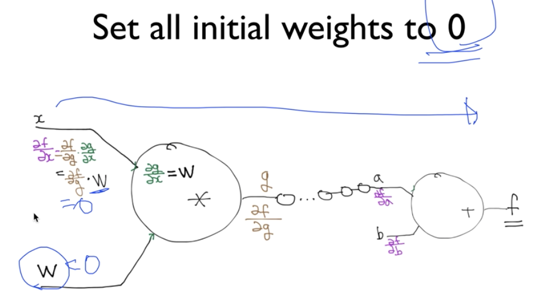
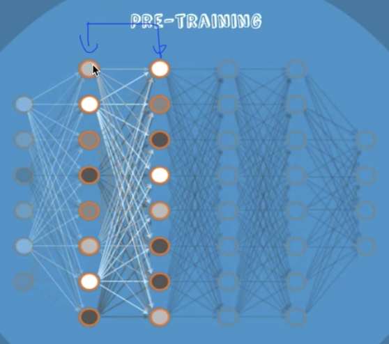
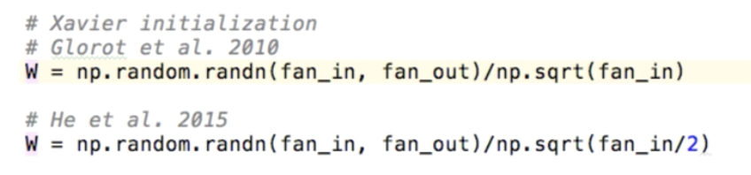

# Lec 10-2. Initialize weights in a smart way

 

**같은 코드임에도 cost가 떨어지는 모양이 다르다 -> weights 의 초기값에 따라 다름**

  

 

## weights 어떻게 초기화 해야할까?

### 모든 weight 를 0으로 초기화하기

**vanishing gradient** 를 초래하므로 안된다.

 

### RBM (Restricted Boltzmann Machine)

(내용은 너무 어렵다...)

간단히 설명하자면 **Autoencoder**.

`unsupervised learning` 을 통해 encoding/decoding 했을 때 동일한 input 값을 갖도록 하는 `w` 값을 찾아낸다.

`비지도학습 (unsupervised learning)` 이기 때문에 weight를 초기화하는데에 `x`값만 있으면 된다.

 

### 이후 더 좋은 초기화 방법 발견됨

`Xavier initialization` 과 `He initialization`.

**Xavier** 와 **He** 는 표준 정규 분포식을 이용한다.

 

