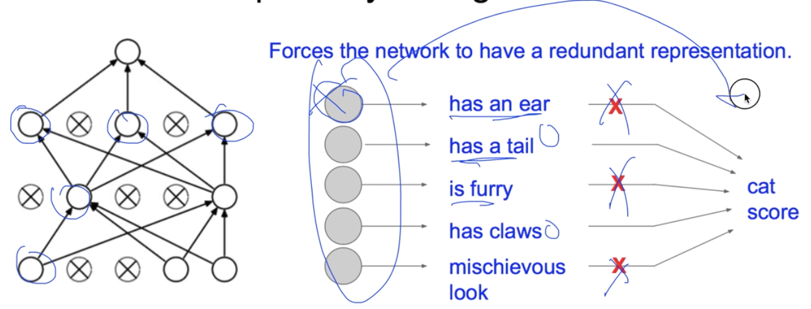
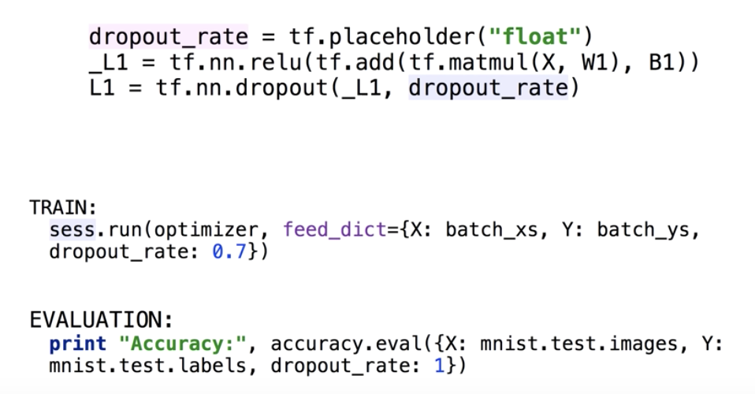
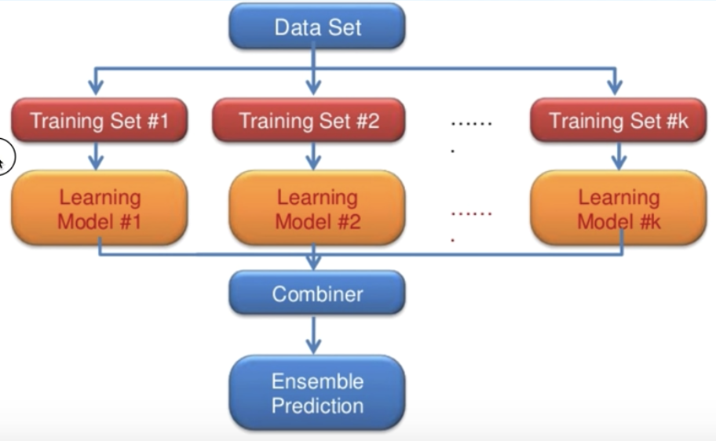

# Lec 10-3. NN dropout and model ensemble

드롭아웃과 모델 앙상블을 이용해 **overfitting을 극복**해보자

 

## Solutions for overfitting

overfitting 을 해결하려면..

- 더 많은 training data 사용
- feature의 수를 줄이자 (모델 복잡도 ⬇) 
  - → 딥러닝에서는 굳이 그럴 필요 없다
- **Regularization** 
  - → 딥러닝에서 주로 사용하는 방법

 

## Regularization: dropout

### dropout

노드 버리기!

학습 단계에서 모든 노드들의 weights 를 조정하지않고 일정 비율 버리면서 학습한다.

**<u>주의할 점</u>**

학습 단계에서는 `dropout_rate` 를 1 이하 값을 줘서 dropout 시키지만, 실제 test (evaluation) 단계에서는 **<u>버려지는 노드가 있어선 안된다</u>**.

 

## Ensemble

여러 모델 합치기

