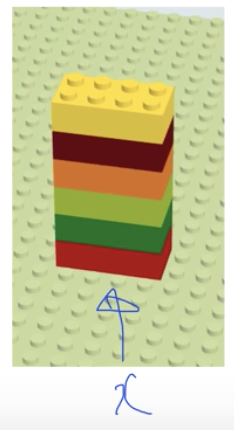
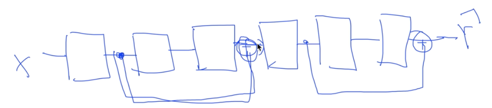
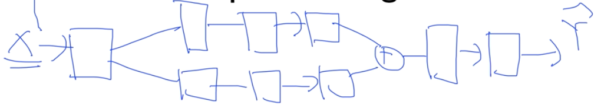
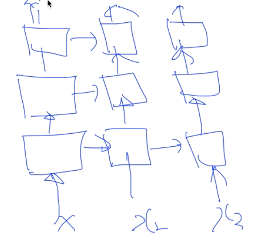

# Lec 10-4. NN LEGO Play

여러 신경망 네트워크를 *레고* 처럼 쌓아서 조합해보자!

 

## Feed forward NN

우리가 공부해봤던 일반적인 NN

 

## Fast forward NN

2단계 뒤 레이어에 연결한다.

ResNet 의 구조이다.

 

## Split & Merge NN

`CNN (Convolutional Neural Network)` 의 구조이다.

 

## Recurrent NN

`RNN` 의 구조이다.