# Lec 10-1. Sigmoid 보다 ReLU 가 더 좋다

 

지난 강의를 리마인드하며 **XOR 문제**를 풀어보자.

 

## input, output, hidden layer

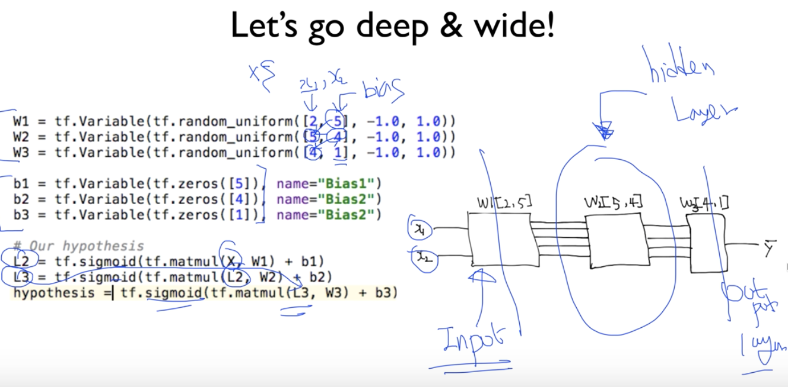

Neural Network 에서

- 맨 앞의 layer 를 `input layer`
- 맨 뒤의 layer 를 `output layer`
- 그리고 그 사이의 layer 를 `hidden layer` 라고 부른다.

 

## 9개 히든 레이어를 가진 네트워크를 만들어보자

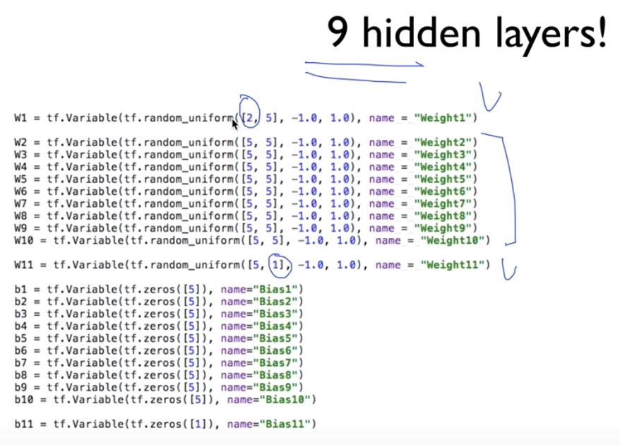

먼저 `weight` 와 `bias` 들을 미리 정의해 본다.

- input layer **(W1)** 의 shape (2, 5) 의 `2` 와
- output layer **(W11)** 의 shape (5, 1) 의 `1` 만 신경쓰면 된다.
- 나머지는 hidden layer 의 shape 이므로 마음대로 설정해줄 수 있다.

 

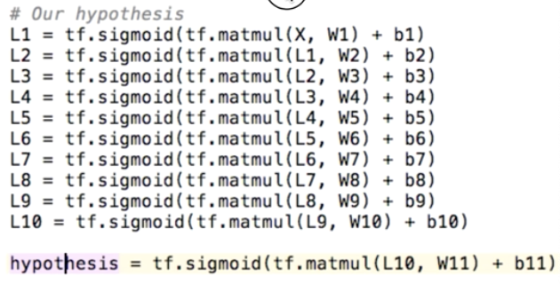

그리고 앞서 정의한  `weight`들과 `bias` 들을 연결한다.

마지막 레이어는 output layer 이고, 이는 우리의 **hypothesis** 가 된다.

 

## 그런데 결과는 좋지 못함

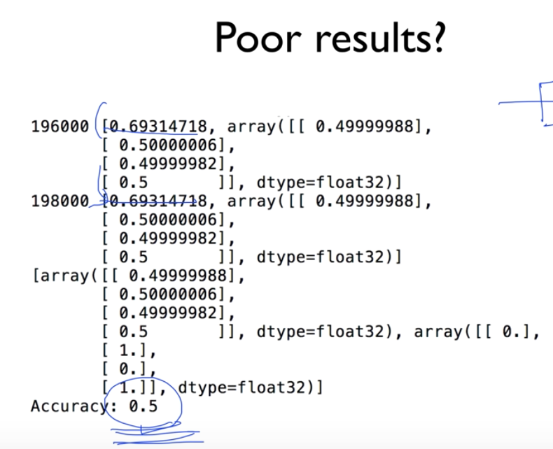

히든 layer 수를 늘려서 Deep한 Network 를 만들었는데도, 정확도 0.5 에 수렴한다...

### 왜? : Vanishing Gradient

**<u>Vanishing Gradient 가 발생하기 때문</u>**

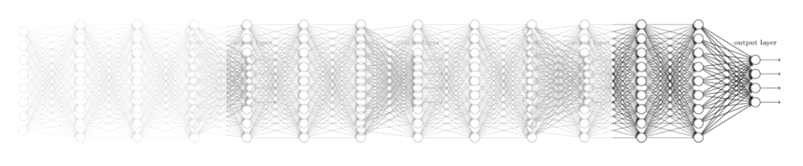

**<u>Vanishing Gradient 왜 발생할까?</u>**

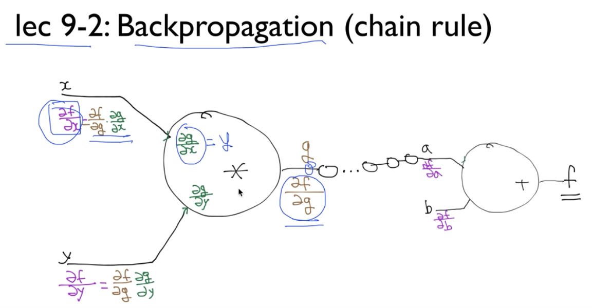

지난 강의에서 Backpropagation 알고리즘 작동 원리를 생각해보자.

**backward** 시 `df/dx` 를 `df/dg` 와 `dg/dx` 를 곱해서 얻을 수 있었다.

> df/dx = df/dg * dg/dx

여기서 `df/dg` 는 이전 단계에서 구해진 값이고, `dg/dx` 는 현재 단계에서 미리 구해질 수 있는데,

만약 노드 `g` 가

> g = xy

라면, `dg/dx` 는 `y` 가 된다.

> dg/dx = y

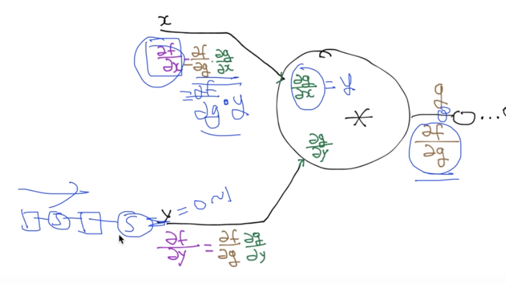

`x` 와 `y` 를 input layer 가 아닌 hidden layer 속 **이전 레이어의 output 이라고 생각**한다면

`y` 는 **`sigmoid` 함수를 거쳐나왔으므로 항상 0~1 사이 값일 것이다.**

그렇다면 `dg/dx` 는 0과 1 사이의 값이 되고 

> df/dx = df/dg * dg/dx
>
> df/dx = df/dg * [0~1 값]

그러므로 output layer 에서 input layer 방향으로 **backward** 미분 진행 시 input layer 로 갈 수록 미분값이 점점 작아지게 된다. **(layer를 거쳐갈때마다 sigmoid 함수를 적용하므로 미분 시 0~1 사이 값이 곱해지기 때문.)**

 

## 하지만 해결

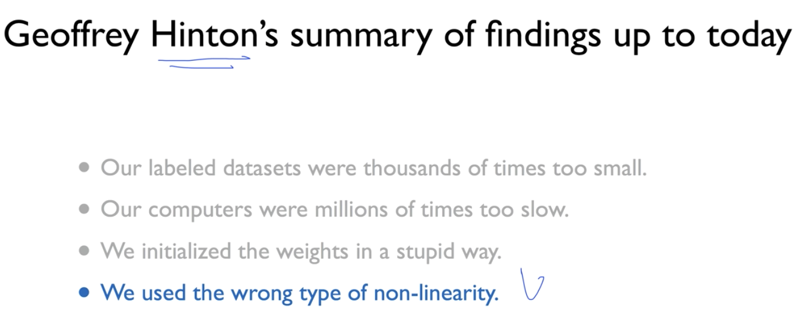

지난 강의 Hinton 교수님의 Neural Network 가 성공하지 못했던 4가지 이유 중

**"We used the wrong type of non-linearity"**

> 잘못된 non-linearity 를 사용하고 있었다 = sigmoid

 

### Sigmoid 문제점

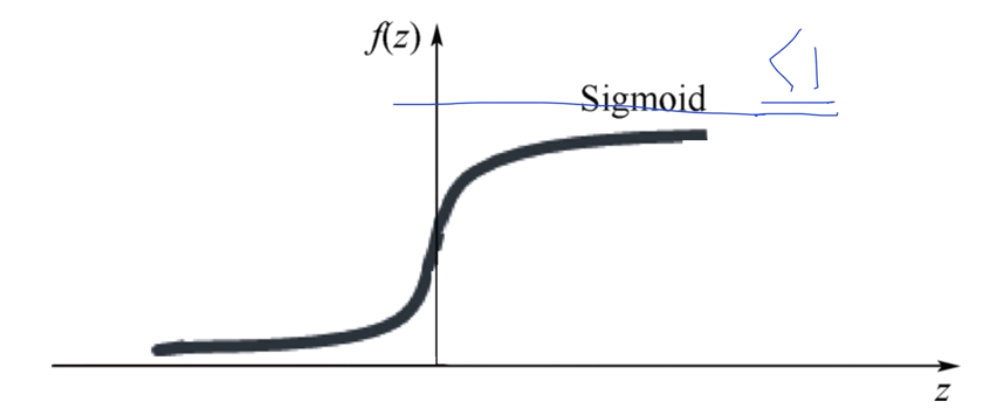

출력값이 항상 1보다 작다...

 

### ReLU (Rectified Linear Unit)

<u>**ReLU**</u>

- f(z) = z  (if z>=0)  **>> ReLU 는 1 이상의 값을 출력값으로 만들 수 있다**
- f(z) = 0  (if z<0)

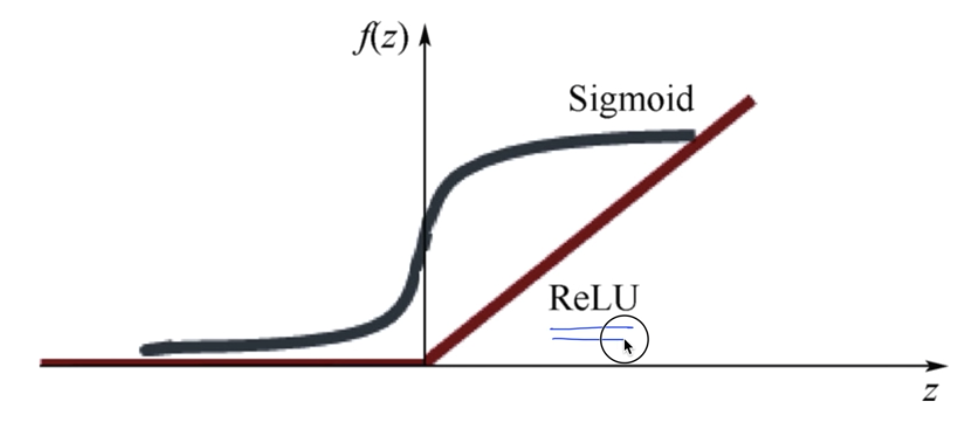

`activation function` 으로 Sigmoid 대신 ReLU 를 사용함으로써 해결!

 

### ReLU 사용

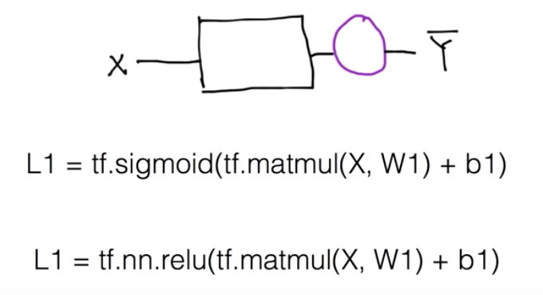

단지 `activation function` 으로 sigmoid 자리를 relu 로 채워주면 된다. 간단!

 

## 다시 모델링

아까 9개의 히든레이어의 **vanishing gradient 현상** 때문에 잘 작동하지 않았던 모델을 `relu` 를 적용해 테스트해보자

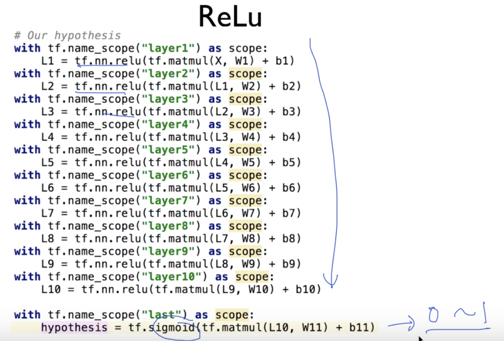

`activation function` 으로 `sigmoid` 대신 `relu` 를 사용한 모습.

마지막 hypothesis (output layer) 에서는 `sigmoid` 를 사용했는데, 

이는 XOR 문제의 결과값이 0~1 사이 값을 가져야 **0.5 이상 True, 0.5 미만 False** 의 cast 적용할 수 있기 때문이다.

 

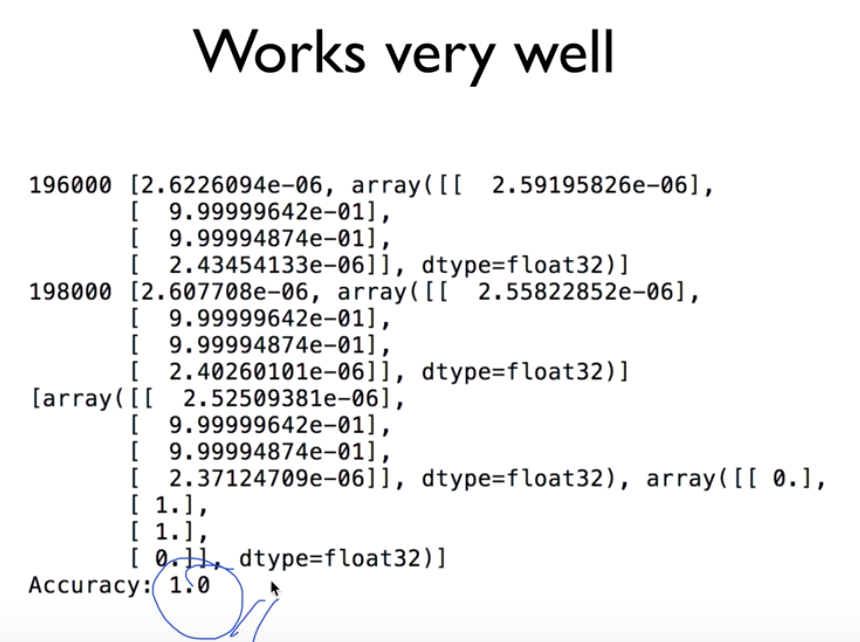

정확도 1.0 로 XOR 문제를 **deep neural network** 로 해결하였다.

 

 

## 그 외 다양한 Activation Funtions

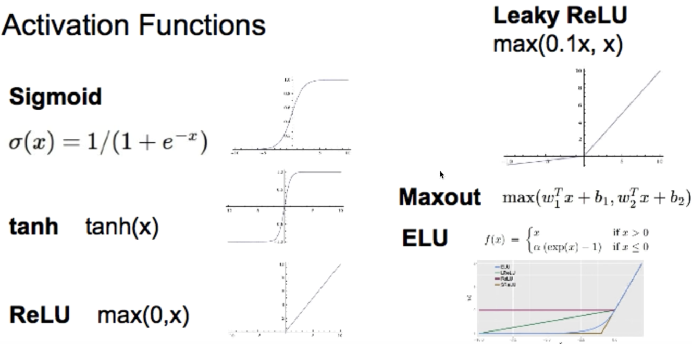

 

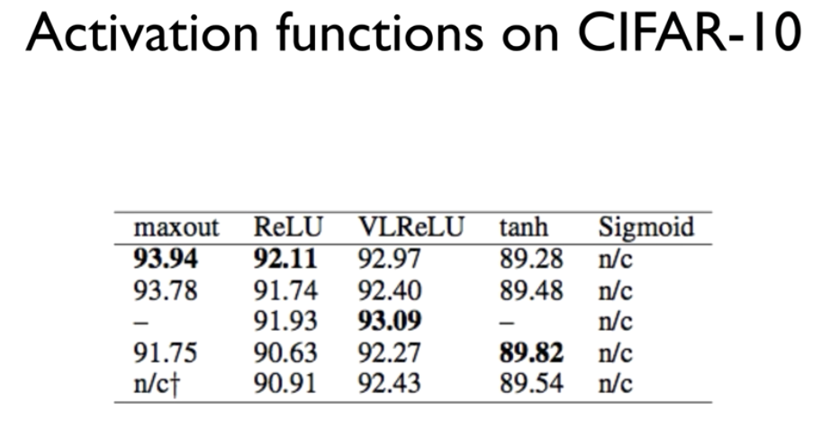

